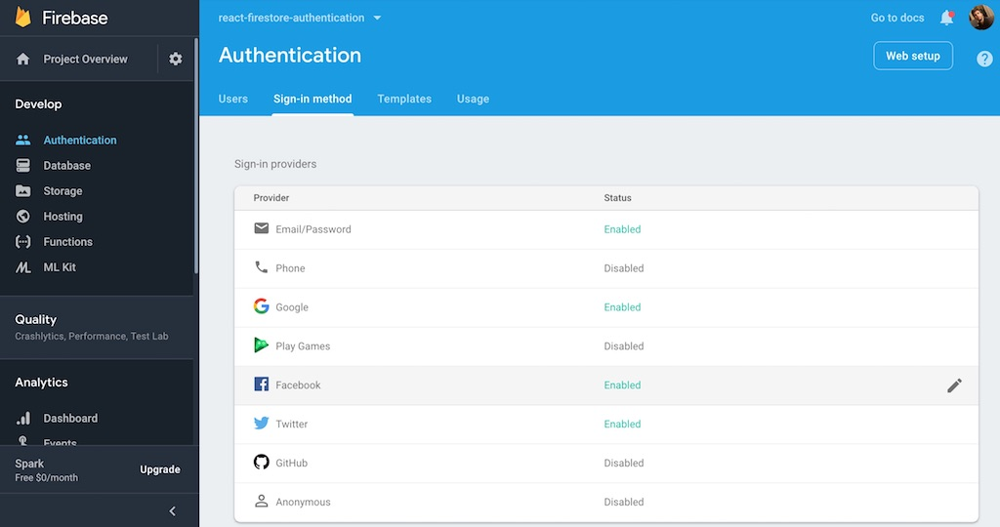
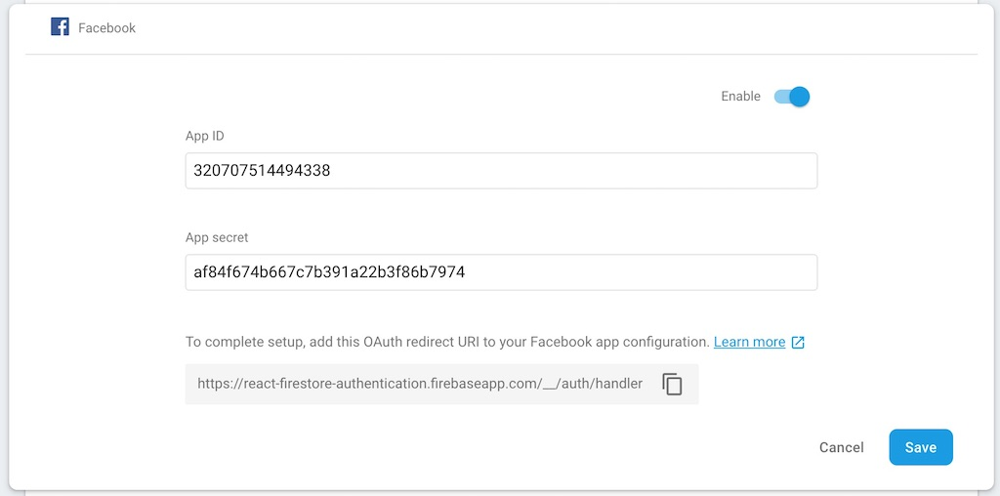
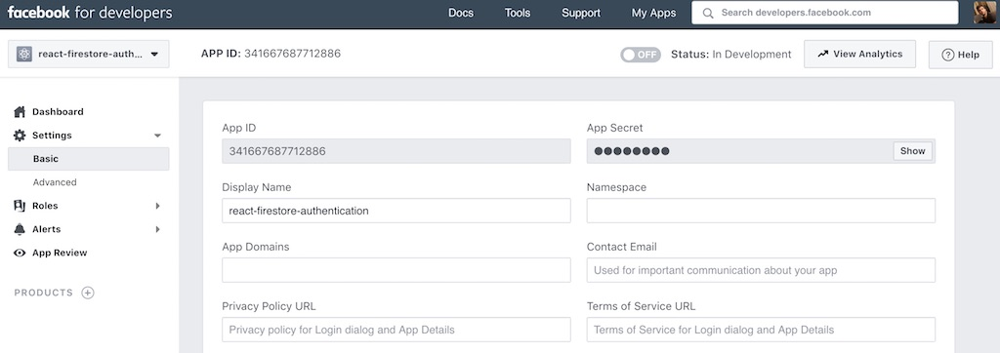
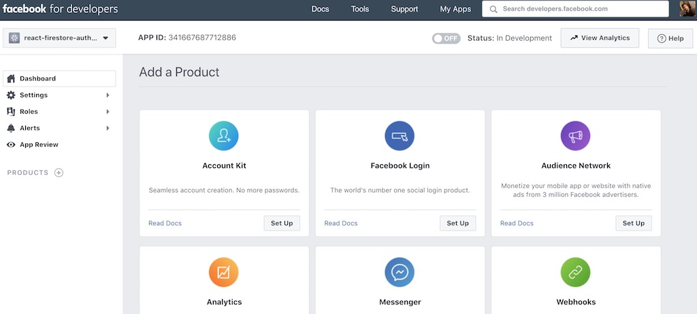

<Sponsorship />

<ReactFirebaseBook />

In this short visual guide, I want to show you how to activate the Facebook authentication for your Firebase or Firestore application. It should only take you a couple of minutes to set up the Facebook as web login for your app. Afterward, there is no email needed for your users to authenticate with your application.

First, on your Firebase project's dashboard, navigate to the Authentication/Sign-in method option. There you can enable the Facebook sign in method that enables you to login people via Facebook to your [Firebase application](https://www.robinwieruch.de/complete-firebase-authentication-react-tutorial).

When enabling the Facebook login method, where no email is needed to sign in to your application later, you need to provide an API key and API secret. Note that all shown sensitive data is fake here, so there is no need to do something with it.

You will get both credentials when creating a Facebook App which we will do in the next steps. Also you need to copy the callback URL for later, because this needs to be provided when creating the Facebook App.

Head over to Facebook to [create a Facebook App](https://developers.facebook.com/). If you don't have a Facebook account yet, create one and optionally follow [my posts](https://www.facebook.com/rwieruch/) for other web development tutorials. Next provide an identifiable App name and insightful App description.

Create your application. Afterward, you can edit the details of your Facebook App. For instance, retrieve your App ID and App Secret for your Facebook App from your Settings/Basic configuration to use them somewhere else. If you setup the Facebook Sign In Method for Firebase, provide Firebase the App ID and the App Secret when enabling it.

You also want to enable the Login Product for your Facebook App. Navigate to your Dashboard and scroll until you see the Products area. There you can choose the Facebook Login Product.

Afterward, under the Settings configuration for the Facebook Login, provide the OAuth redirect URI that you get when enabling the Facebook Sign In Method in Firebase.

You should be able to use the Facebook App in your [Firebase application](https://www.robinwieruch.de/react-firebase-social-login) or any other application now.
