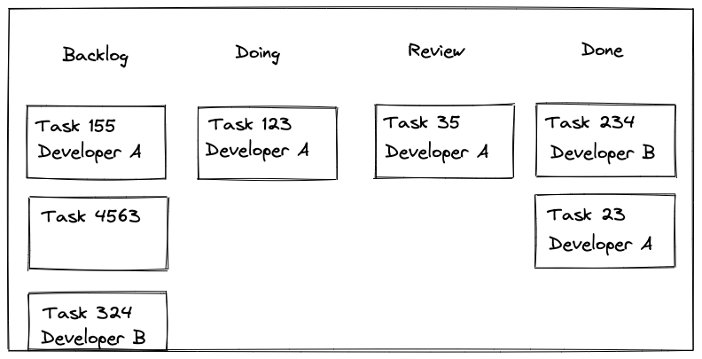
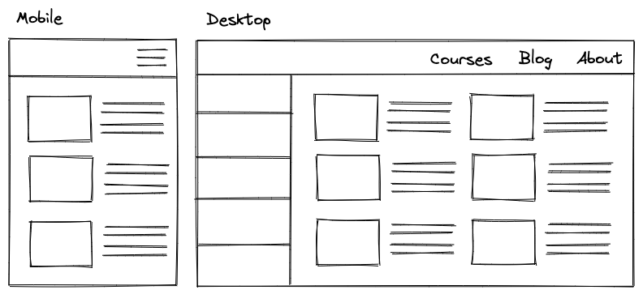
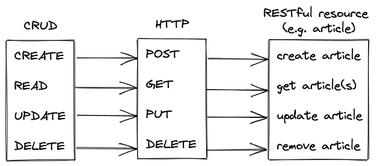

<Sponsorship />

As a freelance React developer, I work with a lot of clients on their React projects these days. Every time I get a request in my inbox, I usually reply with the same email template which I call the **freelance checklist for React developers**.

*If you are going to sign up for my Newsletter, you will get two email templates -- one from the perspective of a hiring company and one from the perspective of a replying freelancer.*

Essentially this checklist makes your **onboarding as a React freelance developer** more seaming-less when entering a new project and team, because before a company can **hire you as a React freelancer**, both sides need to talk through this checklist to get their requirements aligned.

Here I want to share the items of this checklist in more detail with you -- whether you are are a **on-site/remote React freelancer** who is looking for a job or a company who wants to hire a React freelancer.

# React Freelance Checklist

There are always some details which I want to know as a freelancer before working with a company such as:

* **What's my role in the project?**
* **What's the deadline/milestone for the project?**
* **What's the background of the company?**

However, two of the most important questions for me and other freelancers are the following:

**Is it a greenfield project**? Many freelancers see this as a benefit, because they can be more creative on how to architect the project and which libraries they choose for it while avoiding legacy code in the frontend. However, it's not always the case that you are working on a greenfield project. What I have seen mostly in my career as a remote freelancer were up-and-running projects which ran into challenges and sought for help, because of either missing expertise in React or missing frontend developer power.

**Who is the team?** Depending on the freelancer, you may prefer to work alone or in a team. Working alone can mean two things: Working literally alone on a MVP or working alone as frontend developer but in a vertical tech stack with backend engineers, designers, etc. It can also happen that the company who wants to hire you as a freelancer onboards more than one freelancer to their project. Then it's always good to know who is in charge for the frontend, because if it's only freelancers working on it, it can lead to long discussions.

# Freelance Communication Checklist

When I am working with a new company on their React project, I always try to establish five communication channels:

**Real-Time**: Tools like Slack help to discuss topics in real-time with the stakeholders of the project. It's also the water cooler chat if you like to hang out with the team in the case of a long term project. Anyway, if you want to have a discussion about a topic, this kind of channel is the best for it. However, if it's about specific tasks (and the question is not super urgent), the task manager would be the better place.

**Task Manager**: The communication in a task manager like Trello is more asynchronous than the real-time communication channel, however, this really helps to stay on topic for a specific task. In addition, even though the tasks are done eventually, the stakeholders of the project have always a reference to the past whether it's just linking back to it when having a discussion or looking up why certain decisions were made.

**Pull Requests**: Once a task is finished, PRs are used for code reviews. Even though there is not always a code review happening, the PR can be used to be linked back to the task in the task manager as reference. Vice versa, the task should be linked to the PR.

**Email**: Personally I try to use E-Mail conversations as little as possible and only for more important topics which need to be discussed with stakeholders higher in the command chain (e.g. CEO, PO). Most of the time these people are in the real-time communication channel though, so E-Mail is only used for the onboarding experience and invoicing.

**Meetings**: Yes, even though you are a freelancer, there will be meetings! Depending on how much you are doing for your client, the meetings will happen more often to discuss past or upcoming tasks. In my case, I had clients with weekly, bi-weekly, and monthly meetings. Usually as a freelancer I am not involved in the daily standup sessions though.

As a freelancer working for a company, you should be invited to all these channels at the beginning. If you are working with a larger company, you will be bombarded with invites anyway. So if you don't want to get into VPN et al., ask your client beforehand **how much freelancer onboarding** for their infrastructure is needed

# Workflow Checklist as a React Freelancer

If you are entering an established team, they will already have their workflow and you have to get used to it. This ranges from kanban to scrum, from code reviews to no code reviews, from pushing on master to feature branches. However, if you can change something about it -- which was often the case for me -- or you are the first developer on the MVP, I've got a short list of workflow tips for you:

**Do we do Kanban, Scrum, or Power Yoga?** If I am working with a small team, I am often proposing Kanban for its lean approach. For example, Trello is an established and well-known project management tool for it. Regarding Kanban itself, stick to the official rules: number of lanes, max. number of items per developer per lane, etc.

**Do we do code reviews?** If not working alone, yes. If you have any power to establish proper code reviews for your team, please do it. It will help the whole team to understand each others code, to find bugs, and to discuss cause and effect when introducing something new in the code base.

**Do we do feature branches?** If not working alone, yes. Having everyone pushing on master/develop branches will automatically lead to conflicts. If the team does not know about feature branches, I point them to this [step-by-step tutorial](/git-team-workflow).

<Divider />

Because you are a freelance React developer, companies want to hire you most likely for their frontend application of their [web application](/web-applications). However, this does not mean that everything you will code for this client is a 100% React.

You have to see yourself more as a T-shaped developer, because usually you are working with a team in a vertical stack which encapsulates design, frontend, backend, database, and business. While the database is most often out of your scope, you will likely interact with designers from UI/UX, backend engineers for the API requirements, and other business/tech stakeholders such as POs/PMs/CTOs/CEOs.

# UI/UX Checklist as a React Freelancer

One of the most popular questions: **Should I make it look good or pixel perfect?** Often this depends on the size of the company that's hiring you. If there is a whole UI/UX department, it will be most likely *pixel perfect* -- which means that you will get design mockups from the design team and you need to match them with every pixel (margins, paddings, borders, heights, widths etc.) in HTML and CSS.

In contrast, if you are working with a smaller client, it can happen that there is no person responsible for the UI and thus you are asked *to make it look good*. However, from pixel perfect to make it look good is a spectrum. There will be companies in between which will provide mockups but without the "pixel perfect into code translation" as a requirement.

**Where do I get the mockups from?** If you are asked to work with mockups as a freelance web developer, usually the design team already has their tools of choice to provide the mockups to you. These design tools range from "just getting a PDF with images" to a fully interactive mocked application (which often encapsulates the UX by having user interactions in place as well). The most common tools I had the pleasure to work with are [Zeplin](https://zeplin.io), [Invision](https://www.invisionapp.com), or [Figma](https://www.figma.com).

As said, it really depends on the company hiring you as a React freelancer and their resources. Sometimes you have to create the mockups together with the CEO in a meeting, sometimes you get screenshots from their legacy application (not always the best foundation, but it can work out with guidance), and sometimes you are working with a full-fledged design team which has a solution ready for every screen and user interaction.

**What color scheme, fonts, and assets should I use?** If you are working with a design team, they got you covered. Usually a PDF or link with/to *design guidelines* points you to a color scheme and the fonts which should be used. In addition, a link to a cloud storage (e.g. Google Drive) will give you access to all the assets (e.g. logo, icons). However, if you are working without a dedicated design team or designer, these questions need to be asked when you onboard as a freelance React developer to a new project.

**Are we using in-house icons?** Maybe not for the first onboarding conversation, but definitely a thing you should speak through with your client. Again, when working with a design team (or using a popular UI library), usually the icons are already there.

However, if you are working with a smaller company and their requirements say that you need to use custom icons (not recommended, because of the extra work, but it can happen for highly specialized domains), someone has to create these icons. Regardless of who is creating the icons, be aware that all icons need to meet a shared set of requirements (size, color scheme, margins etc.).

**Should this React project work on mobile too?** Here again, if you are working with a design team and a bigger company in general, they will already know whether they want their project only on desktop, desktop-first yet also on mobile, or even mobile-first.

But if you are working with a smaller company, it's important how you communicate this topic as a freelance React developer, because if you ask the client whether the application should be responsive for mobile/tablet/desktop, they will most likely say yes without considering the immense workload (extra mockups cost, extra implementation cost, various edge cases).

# API Checklist as a React Freelancer

When being hired as a freelance frontend developer, the kind of backends you are dealing with ranges from "legacy backend which got a new REST API for making things web compatible" to "a newly created backend with a REST or even GraphQL API". Most likely the backend isn't a finished project though, because it often grows with the requirements of the frontend (e.g. changing APIs, introducing new APIs, splitting up APIs, performance optimizations for heavy load screens, specialized APIs for offset/cursor-based pagination etc.).

What's important for you as a freelance React developer is the API. So your first question should be: **What kind of API does your backend offer?** Personally, I like to work with GraphQL APIs, but since these are not the status quo (yet), the likelihood of working with a REST API is pretty high -- which is okay by me!

Anyway, no REST API is true REST like it was proposed by [Fielding](https://en.wikipedia.org/wiki/Roy_Fielding) though. That's why it's always good to know whether the backend team knows about the principles of REST when creating their APIs and their delta between RESTful and RESTish. I've been working with "REST APIs" which had unnecessary nestings of resources, obscure naming conventions, and only HTTP GET/POST methods. Knowing about this before the onboarding on a project as a frontend developer is a good indication to avoid unnecessary struggles connecting your frontend to the backend.

**Where do I find the API documentation?** If you are working with GraphQL, the schema (which gets generated automatically) provides you everything you need as a freelance developer. In contrast, when working with REST, you need to align with the backend engineers on a communication channel for the API documentation. I have experienced all of it, while the last one would be one of the better cases:

* API on demand on Slack by asking the backend developer(s)/team
* API on Github by checking the backend GitHub repository
* API on Swagger, et al.

While most of the backends that you will be working on are powered by REST, depending on the project there is a chance that you have other sources for your data such as GraphQL (e.g. custom Backend, Hasura), BaaS (e.g. [Firebase](https://www.roadtofirebase.com)), ABIs (e.g. Ethereum Smart Contract) that you need to be aware of.

# Frontend Checklist as a React Freelancer

As mentioned, it's always good to be a T-shaped frontend developer, because you can work on more things than only frontend. For example, if a client wants to see an MVP from you, you will be most likely responsible for more than just React. In my case, I had clients for which I had to set up an authentication service, configured the CI/CD, or had to wire their database into a GraphQL layer. So always gauge your degree of responsibilities in this new project.

**Do you have already plans of which libraries you want to use?** Whether this question comes up depends on whether the project will have a fresh start by having you as a frontend freelancer or whether the project is already in progress by having an in-house team working on it. In general, this question helps to narrow down the scope of the project.

In addition, most companies approaching me for an MVP already ask about what to use for their project in their initial email, so this gives you an opportunity to show that you know the [React library ecosystem](/react-libraries). In contrast, if a team is already working on the project, this question helps you to get to know the tech stack.

**How much customization is needed?** This is one of the most important questions for me, because whenever a client asks for the estimate of a fresh project, I always ask them whether they want to use off the shelf things (e.g. UI library) or build their own (e.g. custom UI components). Spoiler: Most companies do not want to spend their budget for custom UI components -- because this is often a monthly project in itself -- however, I had a case where this was indeed a requirement.

*Personal recommendation: Try to build a UI library once for a client which has the budget and the requirements for it, because it's a great learning experience for you as a React developer. However, after you have done it once, you can put a checkmark next to this experience. [I have done it myself.](https://trumpf-corp.gitlab.io/treui/ui-components/)*

In the case of UI libraries, **the go-to UI library in React** is [Material UI](https://material-ui.com) these days. The client has to decide whether it's worth it to use a library with a common look and feel (if there is not much budget to customize it). In addition, if the client hires a team of frontend freelancers, where most developers are junior developers, most likely they will have used Material UI before and will be productive from the start. In contrast, choosing a not as popular library like [Chakra UI](https://chakra-ui.com/) gives your project a more special character and many freelancers something new to explore.

But it doesn't end here with customization. Another popular topic are **visualizations and charts in React**. If the client you are going to work for intends to use these kind of things, you should really try to narrow down their requirements here and evaluate these with the different charting libraries that are out there, because this can minimize the workload tremendously by avoiding customizations or using D3 as low-level charting library from the start.

There is always potential for discussion beyond the UI and charting libraries. Other common questions are: **Are we using a state management library?**, **How do we fetch data?**, and **Should we use TypeScript?**.

It's also worth to note that several of the companies I am working with approach me with a license to a closed source React library. I try my best to get them off this path, because my experiences working with a closed source libraries are not the best and as a freelancer I would rather want to extend my knowledge working with **commonly used open source libraries**.

Last but not least, even though every developer knows it should be done, is the question: **How much should be tested?** By asking *how much* you show the intend that you want to test, however, I have been working with several companies which saw testing as an afterthought and rather wanted to complete the project upon deadline. So it really depends on the client you are working with.

<Divider />

In conclusion, I hope this extensive checklist for frontend freelancers helps you to hire a React freelancer as a company, to land a job as a React freelancer, or just to improve the onboarding experience for both parties.
