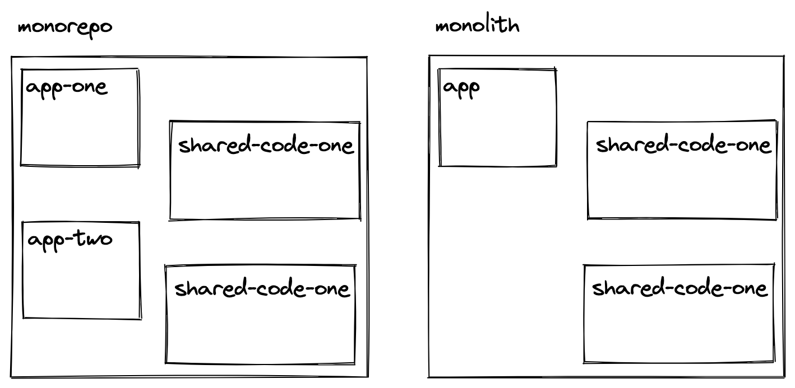
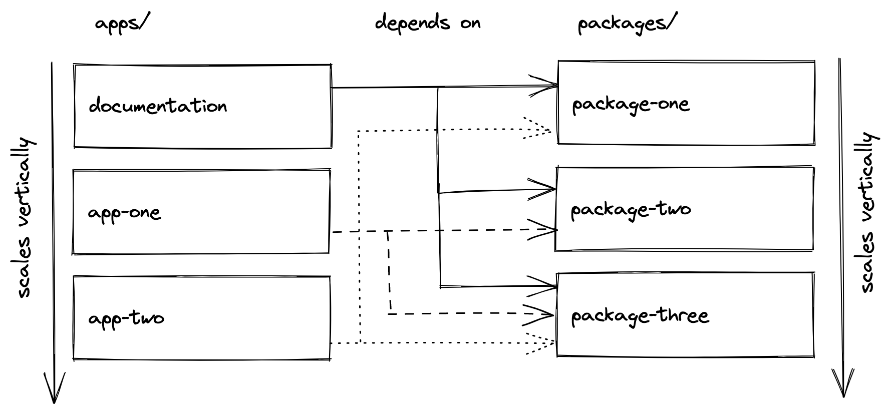
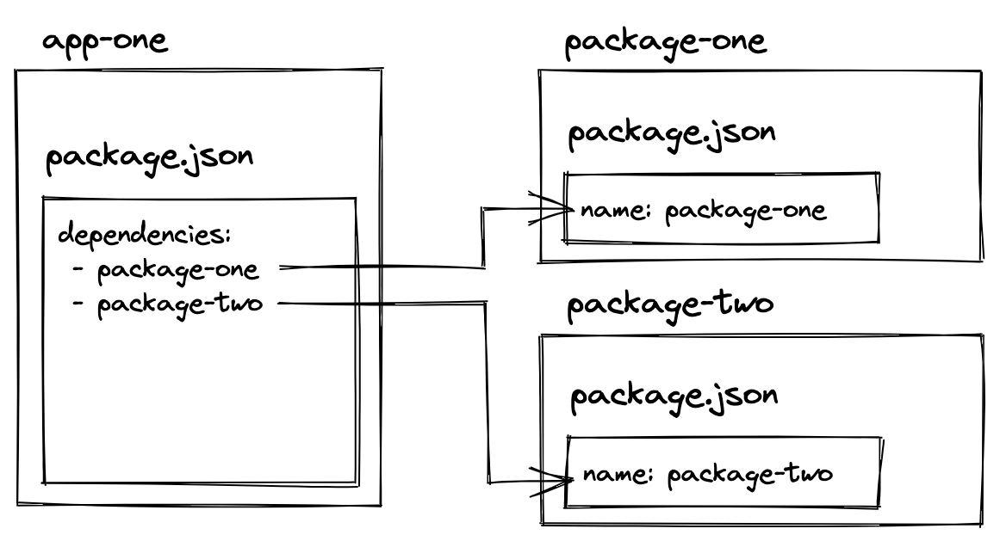
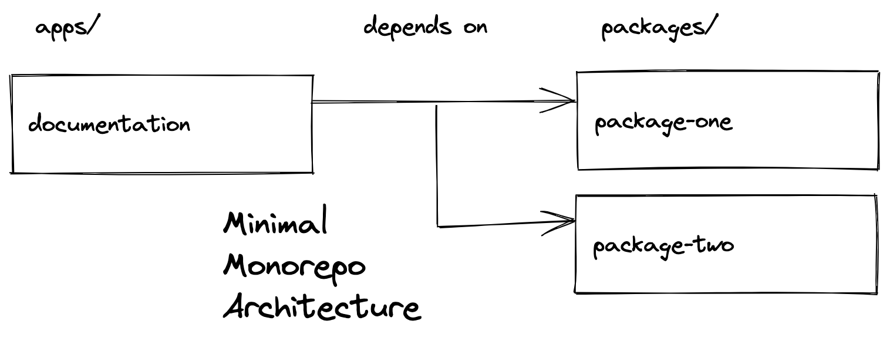
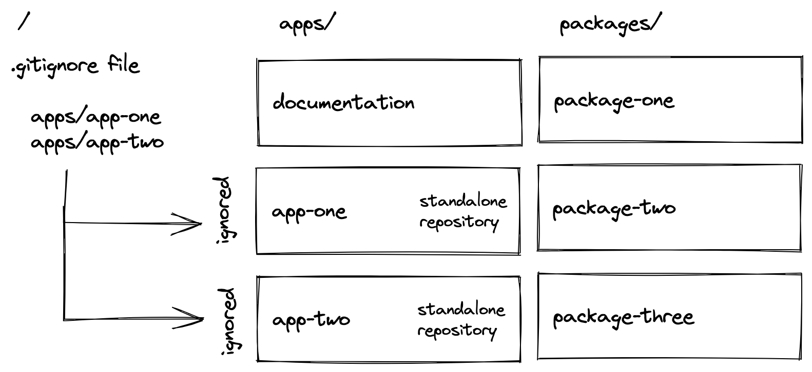
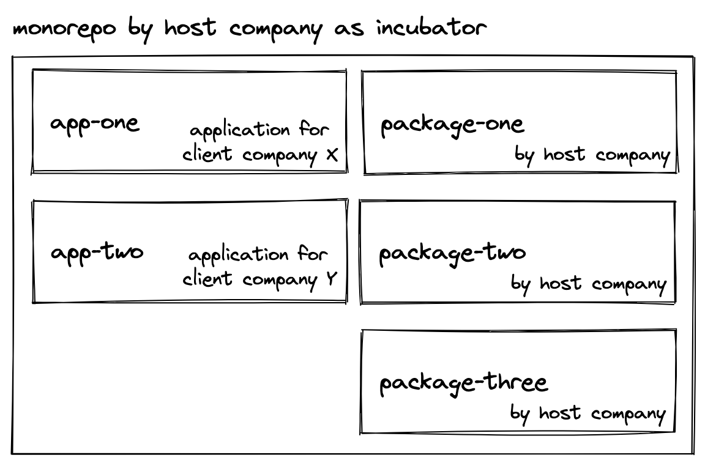

<Sponsorship />

This is a comprehensive tutorial on Monorepos in JavaScript/TypeScript --- which is using state of the art tools for these kind of architectures in frontend applications. You will learn about the following topics from this tutorial:

* What is a monorepo?
* How to structure a monorepo architecture?
* How to create a monorepo?
* Which tools to use for a monorepo?
* How to perform versioning in a monorepo?
* How to create a CI pipeline for a monorepo?
* How to run applications decoupled from the monorepo?

I myself am extremely hyped about Monorepos these days, because they help me with my work as a freelance developer and my open source projects. When I started to use monorepos in JavaScript/TypeScript I must say it just felt natural to combine applications and packages this way. With this walkthrough, I hope to pass along my learnings in this space.

*Shoutout to [Lee Robinson](https://twitter.com/leeerob) who inspired and [helped](https://github.com/vercel/turborepo/tree/main/examples/design-system) me tremendously to get started in this space. Another shoutout goes to [Shawn "Swyx" Wang](https://twitter.com/swyx) who made me aware of [Turborepo](https://www.swyx.io/turborepo-why) and to [Wes Bos](https://twitter.com/wesbos) & [Scott Tolinski](https://twitter.com/stolinski) who had an [episode](https://syntax.fm/show/426/monorepos-workspaces-pnpm-turborepo-more) on SyntaxFM about Monorepos.*

When this tutorial becomes more practical, we will use React.js as framework of choice for creating applications and shared packages (UI components) within this monorepo. However, feel free to use your own framework of choice (e.g. Angular or Vue).

# Table of Contents

<TableOfContents {...props} />

# What is a Monorepo

A monorepo is a project which contains smaller projects -- whereas each project can be anything from individual application to reusable package (e.g. functions, components). The practice of combining projects dates back to the early 2000 when it was called a *shared codebase*.

The name monorepo stems from the words mono (single) and repo ([repository](https://en.wikipedia.org/wiki/Repository_(version_control))). While the former is self-explanatory, the latter comes from version control systems (e.g. git) where either projects:repositories are hosted in a n:n relationship (polyrepo) or a n:1 relationship (monorepo).

Often a monorepo is mistaken for a monolith. However, in a monolithic application all smaller projects are combined into one large project. In contrast, a monorepo can combine its smaller projects into multiple projects.



Monorepos are popular for large scale codebases used by large companies such as [Google](https://cacm.acm.org/magazines/2016/7/204032-why-google-stores-billions-of-lines-of-code-in-a-single-repository/fulltext):

* *"The Google codebase includes approximately one billion files and has a history of approximately 35 million commits spanning Google's entire 18-year existence."* [2016]
* *"Google's codebase is shared by more than 25,000 Google software developers from dozens of offices in countries around the world. On a typical workday, they commit 16,000 changes to the codebase, and another 24,000 changes are committed by automated systems."* [2016]

However, these days monorepos become popular for any codebase which has multiple applications with a shared set of (in-house) packages ...

# Why use a Monorepo

There are two major advantages using a monorepo for a large scale codebase. First of all, shared packages can be used in multiple applications on a local machine without an online registry (e.g. npm). The developer experience improves tremendously here, because everything is in the same codebase without updating dependencies via third-parties. When a shared package gets updated, it gets immediately reflected in all applications which depend on it.

Second, it improves collaboration across codebases. Teams working on different projects can improve the codebases from other teams without working on multiple repositories. It also improves accessibility without worrying about different setups and introduces a more flexible ownership of the source code across teams. Another benefit is the refactoring of code across many projects.

# Structure of a Monorepo

A monorepo can contain multiple applications (here: apps) whereas each application has access to shared set of packages. Bear in mind that this is already an opinionated monorepo structure:

```text
- apps/
--- app-one
--- app-two
- packages/
--- package-one
--- package-two
--- package-three
```

A package, which is just a folder, can be anything from UI components (e.g. framework specific components) over functions (e.g. utilities) to configuration (e.g. ESLint, TypeScript):

```text
- apps/
--- app-one
--- app-two
- packages/
--- ui
--- utilities
--- eslint-config
--- ts-config
```

A package can be a dependency of another package. For example, the *ui* package may use functions from the *utilities* package and therefore the *ui* package depends on the *utilities* package. Both, *ui* and *utilities* package, may use configuration from the other *\*-config* packages.

The *apps* are usually not dependent on each other, instead they only opt-in *packages*. If packages depend on each other, a monorepo pipeline (see **Monorepo Tools**) can enforce scenarios like "start *ui* build only if the *utilities* build finished successfully".


Since we are speaking about a JavaScript/TypeScript monorepo here, an *app* can be a JavaScript or TypeScript application whereas only the TypeScript applications would make use of the shared *ts-config* package (or create their own config or use a mix of both).

Applications in *apps* don't have to use shared *packages* at all. It's opt-in and they can choose to use their internal implementations of UI components, functions, and configurations. However, if an application in *apps* decides to use a package from *packages* as dependency, they have to define it in their *package.json* file:

```json
{
  "dependencies": {
    "ui": "*",
    "utilities": "*",
    "eslint-config": "*"
  },
}
```

Applications in *apps* are their own entity and therefore can be anything from a SSR application (e.g. [Next.js](/react-libraries/)) to a CSR application (e.g. [CRA/Vite](/react-libraries/)).

<ReadMore label="Web Applications 101" link="/web-applications/" />

In other words: applications in *apps* do not know about being an repo in a monorepo, they just define dependencies. The monorepo (see **Workspaces in Monorepos**) decides then whether the dependency is taken from the monorepo (default) or from a registry (fallback, e.g. npm registry).

Reversely, this means that an application can be used without being part of the monorepo as well. The only requirement is that all its dependencies (here: *ui*, *utilities*, *eslint-config*) are published on a registry like npm, because when used as a standalone application there is no monorepo with shared dependencies anymore (see **Versioning with Monorepos**).

# How to create a Monorepo

After all these learnings in theory about monorepos, we will walk through an example of a monorepo as a proof of concept. Therefore, we will create a monorepo with React applications (*apps*) which use a shared set of components/configuration (*packages*). However, none of the tools are tied to React, so you can adapt it to your own framework of choice (e.g. Angular or Vue).

We will not create a monorepo from scratch though, because it would involve too many steps that would make this whole topic difficult to follow. Instead we will be using a starter monorepo. While using it, I will walk you through all the implementation details which went into it step by step.

Start off by cloning the [monorepo starter](https://github.com/bigstair-monorepo/monorepo) to your local machine:

```text
git clone git@github.com:bigstair-monorepo/monorepo.git
```

We are using yarn as alternative to npm here, not only for installing the dependencies, but also for using so called workspaces later on. In the next section (see **Workspaces in Monorepos**), you will learn about workspaces and alternative workspaces tools in contrast to yarn workspaces. For now, navigate into the repository and install all the dependencies with yarn:

```sh
cd monorepo
yarn install
```

While explaining other parts later, we will focus on the following content of the monorepo for now:

```text
- apps/
--- docs
- packages/
--- bigstair-core
--- bigstair-map
--- eslint-config-bigstair
--- ts-config-bigstair
```

The monorepo comes with one "built-in" application called *docs* in *apps* for the documentation. Later we will integrate actual applications (see **Workspaces in Monorepos**) next to the documentation.

In addition, there are four *packages* -- whereas two packages are shared UI components (here: *bigstair-core* and *bigstair-map*) and two packages are shared configurations (here: *eslint-config-bigstair* and *eslint-config-bigstair*).

We are dealing with a fake company called *bigstair* here which becomes important later (see **Versioning with Monorepos**). For now, just think away the bigstair naming which may make it more approachable. Furthermore, we will not put much focus on the ESLint and TypeScript configurations. You can check out later how they are reused in *packages* and *apps*, but what's important to us are the actual applications and the actual shared packages:

```text
- apps/
--- docs
- packages/
--- core
--- map
```

For the two *packages* imagine any JavaScript/TypeScript code that should be consumed in our *apps*. For example, while the *core* package could have baseline UI components like buttons, dropdowns, and dialogs, the *map* package could have a reusable yet more complex Map component. From the *apps* directory's perspective, the separate packages are just like libraries solving different problems. After all, this only shows that the packages folder can scale vertically the same way as the apps folder.

<Divider />

To conclude this section, run the following command to run the *apps/docs* application. We will discuss later (see **Monorepo Tools**) why this command allows us to start a nested application in the apps folder in the first place:

```sh
yarn dev
```

You should see a [Storybook](https://storybook.js.org/) that displays components from the *core* and *map* packages. In this case these components are only buttons (and not a map) for the sake of keeping it simple. If you check the *core* and *map* package's source code, you should find the implementation of these components:

```javascript
import * as React from 'react';

export interface ButtonProps {
  children: React.ReactNode;
}

export function Button(props: ButtonProps) {
  return <button>{props.children}</button>;
}

Button.displayName = 'Button';
```

Furthermore, the *package.json* files of both packages define a `name` property which are defined as dependencies in the *docs* application's *package.json*:

```json
"dependencies": {
  "@bigstair/core": "*",
  "@bigstair/map": "*",
  "react": "18.0.0",
  "react-dom": "18.0.0"
},
```

If both packages would be available via the npm registry, the *docs* application could install it from there. However, as mentioned earlier, since we are working in a monorepo setup with workspaces (see **Workspaces in Monorepos**), the *package.json* file of the *docs* application checks first if these packages exist in the monorepo before using the npm registry as fallback.

Last, check the implementation details of the *docs* application. There you will see that it imports the packages like third-party libraries even though they are packages in the monorepo:

```javascript
import { Button } from '@bigstair/core';
```

This underpins again the fact that an application in *apps* doesn't know that it plays a part in a monorepo (see **Incubating**). If it wouldn't be in a monorepo (see **Hatching**), it would just install the dependencies from the npm registry.

# Workspaces in Monorepos

A monorepo, in our case, consists of multiple apps/packages working together. In the background, a tool called workspaces enables us to create a folder structure where *apps* can use *packages* as dependencies. In our case, we are using [yarn workspaces](https://yarnpkg.com/features/workspaces) to accomplish our goal. There are alternatives such as [npm workspaces](https://docs.npmjs.com/cli/v7/using-npm/workspaces) and [pnpm workspaces](https://pnpm.io/workspaces) too.

A yarn workspace gets defined the following way in the top-level *package.json* file:

```json
"workspaces": [
  "packages/*",
  "apps/*"
],
```

Since we already anticipate that we have multiple *apps* and *packages*, we can just point to the folder path and use a wildcard as subpath. This way, every folder in *apps*/*packages* with a *package.json* file gets picked up. Now, if an application from *apps* wants to include a package from *packages*, it just has to use the `name` property from the package's *package.json* file as dependency in its own *package.json* file (as we have seen before). Note that the structure of having *apps* and *packages* is already opinionated at this point.

<Divider />

In practice, it's about multiple *apps* which can opt-in local *packages* as dependencies. However, so far we have only used the *docs* application which uses our monorepo's *packages*. Furthermore, the *docs* application is just there for documentation of these packages. What we want are actual applications using the shared packages.



Navigate into the *apps* folder where we will clone two new applications into the monorepo. Afterward, navigate back again and install all new dependencies:

```sh
cd apps
git clone git@github.com:bigstair-monorepo/app-vite-js.git
git clone git@github.com:bigstair-monorepo/app-vite-ts.git
cd ..
yarn install
```

Installing all dependencies is needed here for two things:

* First, the new applications in *apps* need to install all their dependencies -- including the *packages* which they define as dependencies as well.
* Second, with two new nested workspaces coming in, there may be new dependencies between *apps* and *packages* that need to be resolved in order to have all workspace working together.

Now when you start all *apps* with `yarn dev`, you should see the Storybook coming up in addition to two new React applications which uses the Button component from the *packages*.

<Divider />

Both cloned applications are React applications bootstrapped with [Vite](https://vitejs.dev/). The only thing changed about the initial boilerplates is its dependencies in the *package.json* where it defines the *packages* from our workspaces as third-parties:

```json
"dependencies": {
  "@bigstair/core": "*",
  "@bigstair/map": "*",
  ...
}
```

Afterward, they just use the shared components the same way as we did before in the *docs*:

```javascript
import { Button } from '@bigstair/core';
```

Because we are working in a monorepo setup, to be more specific in workspace setup which enables this kind of linking between projects (here: *apps* and *packages*) in the first place, these dependencies are looked up from the workspaces before installing them from a registry like npm.



As you can see, any JavaScript or TypeScript application can be bootstrapped in the *apps* folder this way. Go ahead and create your own application, define the *packages* as dependencies, `yarn install` everything, and use the shared components from the *packages* workspaces.

<Divider />

At this point, you already have seen the global *package.json* file in the top-level directory and local *package.json* files for each project in *apps* and *packages*. The top-level *package.json* file defines the workspaces in addition to global dependencies (e.g. eslint, prettier) which can be used in every nested workspace. In contrast, the nested *package.json* files only define dependencies which are needed in the actual project.

# Monorepo Tools

You have witnessed how workspaces already allow us to create a monorepo structure. However, while workspaces enable developers to link projects in a monorepo to each other, a dedicated monorepo tool comes with an improved developer experience. You have already seen one of these DX improvements when typing:

```sh
yarn dev
```

Executing this command from the top-level folder starts all of the projects in the monorepo which have a `dev` script in their `package.json` file. The same goes for several other commands:

```sh
yarn lint
yarn build
yarn clean
```

If you check the top-level *package.json* file, you will a bunch of overarching scripts:

```json
"scripts": {
  "dev": "turbo run dev",
  "lint": "turbo run lint",
  "build": "turbo run build",
  "clean": "turbo run clean",
  ...
},
"devDependencies": {
  ...
  "turbo": "latest"
}
```

A monorepo tool called [Turborepo](https://turborepo.org/) allows us to define these scripts. Alternative monorepo tools are [Lerna](https://lerna.js.org/) and [Nx](https://nx.dev/). Turborepo comes with several configurations that allow you to execute the scripts for its nested workspaces in parallel (default), in order, or filtered:

```json
"scripts": {
  "dev": "turbo run dev --filter=\"docs\"",
  ...
},
```

In addition, you can create a *turbo.json* file (open it yourself) to define a monorepo pipeline for all the scripts. For example, if one package has another package as dependency in the *packages* workspace, then one could define in the pipeline for the build script that the former package has to wait for the build of the latter package.


Last but not least, Turborepo comes with advanced caching capabilities for files which work locally (default) and remotely. You can opt-out of local caching any time. You can check out Turborepo's documentation here, because this walkthrough does not go into any more detail here.

# Documentation in Monorepos

Because many monorepos come with applications which access a shared set of packages, it's already the perfect architecture to have one dedicated application for documentation purposes which also gets access to the *packages*.



Our initial setup of the monorepo already came with a *docs* application which uses Storybook to document all of the package's UI components. However, if the shared packages are not UI components, you may want to have other tools for documenting concepts, usage, or APIs.

From this "minimal monorepo architecture", which comes with shared packages, documentation of the shared packages, and a proof of concept that the monorepo architecture works by reusing the packages in the documentation, one can extend the structure by adding more applications or packages to it as we have done in the **Workspaces in Monorepos** section.

# Monorepos vs Polyrepos in Git

If nothing speaks against it, one can host a monorepo with all its workspaces in a single Git repository. That's the prime definition of a monorepo after all. However, once a monorepo scales in size with multiple workspaces, there is *maybe* (!) the need (see **Example: Monorepos as Incubators**) for separating the monorepo into multiple Git repositories. That's what we already did with the *apps* (except for *docs*) in our monorepo walkthrough.

There may be various ways to move from a single Git repository to multiple Git repositories for a monorepo -- essentially creating a polyrepo in disguise as a monorepo. In our case, we just used a top-level *.gitignore* file which ignores two of the nested workspaces from the *apps* which should have their dedicated Git repository.



However, this way we always work on the latest version of all workspaces (here: *apps* and *packages*), because when cloning all nested workspaces into the monorepo or as standalone application, they just use the recent code. We get around this flaw when taking versioning into account next.

# Versioning with Monorepos

Applying versions, especially to shared *packages* in a monorepo which may end up online in a package manager (e.g. npm registry) eventually, is not as straightforward as expected. There are multiple challenges like *packages* can depend on each other, there is more than one package to keep an eye on, packages are nested folders in *packages*, and each package has to have its own changelog and release process.

In a monorepo setup, the *packages* behave like dependencies, because the *apps* are using them from the workspace setup (and not the registry). However, if an application does not want to use the recent version of a package in a workspace, it can define a more specific version of it:

```json
"dependencies": {
  "@bigstair/core": "1.0.0",
  "@bigstair/map": "1.0.0",
  ...
}
```

In this case, if the version of the package in the workspace is different from the specified version, the install script will not use the workspace package but the registry instead. Therefore we need a way to create versions, changelogs, and releases for *packages* while developing the monorepo.

<Divider />

The [changesets](https://github.com/changesets/changesets) project is a popular tool for managing versions of multiple packages in a multi-package repositories (e.g. monorepo). Our monorepo setup already comes with an installation of changesets and scripts defined in the top-level *package.json* file. We will walk through each of these changesets scripts step by step:

```json
"scripts": {
  ...
  "changeset-create": "changeset",
  "changeset-apply": "changeset version",
  "release": "turbo run build && changeset publish"
},
```

Versioning packages will include publishing them to a registry (e.g. npm). If you want to follow along, you need to perform the following steps as prerequisite:

* create an organization on [npm](https://www.npmjs.com/) which allows you to publish packages
* npm login on the command line
* use the name of your organization instead of `bigstair` everywhere in the source code
* verify with `yarn install && yarn dev` that everything still works as expected

Another prerequisite before we can version a package: We need to change one of our *packages* first. Go into one of the UI packages and change the source code of the components. Afterward, the mission is to have the change reflected in the new version which gets published to npm.


* First, run `yarn changeset-create` which enables you to create a changelog for changed packages. The prompt walks you through selecting a package (use spacebar), choosing the semver increment (major, minor, patch), and writing the actual changelog. If you check your repository afterward with `git status`, you will see the changed source code in addition to a newly created changelog file. If packages depend on each other, the linked packages will get a version bump later too.

* Second, if the changelog file is okay, run `yarn changeset-apply` which applies the changelog and the version to the actual package. You can check again with `git status` and `git diff` if everything looks as desired.

* Third, if everything looks okay, go ahead and release the updated packages to npm with `yarn release`. After the release, verify on npm that your new version got published there.

Essentially that's everything to versioning your packages on your local machine. The next section takes it one step further by using continuous integration for the versioning (2) and publishing (3) steps.

# Continuous Integration with Monorepos

The complexity of the Continuous Integration (CI) of a monorepo depends on how many repositories get managed on a version control platform like [GitHub](https://github.com/rwieruch). In our case, all *packages* are in the same repository (here they are part of the monorepo itself). Hence we only need to care about CI for this one repository, because in this section it's all about the release of the *packages*.

The example monorepo already uses GitHub Actions for the CI. Open the *.github/workflows.release.yml* file which presents the following content for the GitHub Action:

```javascript
name: Release

on:
  push:
    branches:
      - main

concurrency: ${{ github.workflow }}-${{ github.ref }}

jobs:
  release:
    name: Release
    runs-on: ubuntu-latest
    steps:
      - name: Checkout Repository
        uses: actions/checkout@v2
        with:
          fetch-depth: 0

      - name: Setup Node.js 16.x
        uses: actions/setup-node@v2
        with:
          node-version: 16.x

      - name: Install Dependencies
        run: yarn install

      - name: Create Release Pull Request or Publish to npm
        id: changesets
        uses: changesets/action@v1
        with:
          publish: yarn release
        env:
          GITHUB_TOKEN: ${{ secrets.GITHUB_TOKEN }}
          NPM_TOKEN: ${{ secrets.NPM_TOKEN }}
```

*Note: If this workflow should run on your own GitHub repository, you have to create a `NPM_TOKEN` on npm and use it as repository secret on GitHub. Furthermore, you need enable the "Allow GitHub Actions to create and approve pull requests" for your organization/repository too.*


Now again, change a component in one of the packages. Afterward, use `yarn changeset-create` to create a changelog (and implicit semver version) locally. Next, push all your changes (source code change + changelog) to GitHub. From there the CI with GitHub actions takes over for your monorepo's packages. If the CI succeeds, it creates a new PR with the increased version and changelog. Once this PR gets merged, CI runs again and releases the package to npm.

# Monorepo Architecture

Monorepos are becoming more popular these days, because they allow you to split your source code into multiple applications/packages (opinionated monorepo structure) while still being able to manage everything at one place. The first enabler for having a monorepo in the first place are **Workspaces**. In our case we have been using yarn workspaces, but npm and pnpm come with workspaces as well.

The second enabler are the overarching monorepo tools which allow one to run scripts in a more convenient way globally, to orchestrate scripts in a monorepo (e.g. pipelines in **Turborepo**), or to cache executed scripts locally/remotely. Turborepo is one popular contender in this space. Lerna and Nx are two alternatives to it.

If a monorepo is used in Git, one can optionally decide to split a single repository into multiple repositories (polyrepo in disguise as a monorepo). In our scenario we have been using a straightforward *.gitignore* file. However, there may be other solution to this problem.

In the case of versioning, **Changesets** is a popular tool for creating changelogs, versions, and releases for a monorepo. It's the alternative to [semantic release](https://github.com/semantic-release/semantic-release) in the monorepo space.

In conclusion, Workspaces, Turborepo, and Changesets are the perfect composition of monorepo tools to create, manage, and scale a monorepo in JavaScript/TypeScript.

# Example: Monorepos as Incubators

In my recent job as a freelance frontend developer, I had to set up a monorepo for a company. The company is a software house which develops applications for other companies. Over the years, they have developed packages (e.g. UI components) internally.

**The goal for the monorepo:** being able to develop applications for clients side by side while being able to use shared packages with a great DX.

It mentions great DX, because that's the important point for using a monorepo (see **Why use a Monorepo**): Rather than installing the packages from npm, we can just change them within the scope of the monorepo and see the changes reflected in the applications. Otherwise we would have to go through the whole release + install cycle when adjusting a UI library.



The process for incubating and hatching an application for a company is divided into two consecutive parts which I will explore in the following.

**Incubating:** When on-boarding a new client to the monorepo, we/they create a repository via git from where we clone it into our monorepo. From there, we can opt-in shared packages from the monorepo as dependencies. The client can clone the repository any time as standalone project (without having to rely on the monorepo) while being able to install all dependencies from the registry, because of the mandatory versioning of the shared packages.

**Hatching:** Once a client gets off-boarded, we set a final version to all dependencies in their project's package.json. From there, it's their responsibility to upgrade the packages. Hence the automatically generated changelog of in-house packages on our end if a client decides to upgrade one of them.

# Monorepo FAQ

* **Are there Monorepos for Frontend and Backend?** When working with a frontend and backend, they are are most often loosely coupled via an API. However, there are various aspects where frontend and backend can still use shared packages (type safe API interfaces, utility functions, server-side components). So it's totally possible to have a CSR React application, a SSR React application (e.g. Next.js), and an [Express application](/node-express-server-rest-api/) side by side.

* **Are Monorepos the same as Monoliths?** They are not. A monorepo *can* produce one monolithic application, however there are more likely applications side by side which share the domain of the company or a set of packages but are not *one* self-contained application (definition of monolithic). In the end, there just needs to be the requirement for sharing code across multiple projects.

* **Are there Monorepos for Microfrontends?** Not anything that I can reference here, however, it's absolutely possible to create a user facing application and a admin facing application side by side in a monorepo where the developer decides whether both get stitched together as one monolith or whether they are standalone applications on different (sub)domains (e.g. my-application.com and admin.my-application.com).
