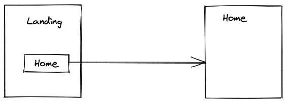
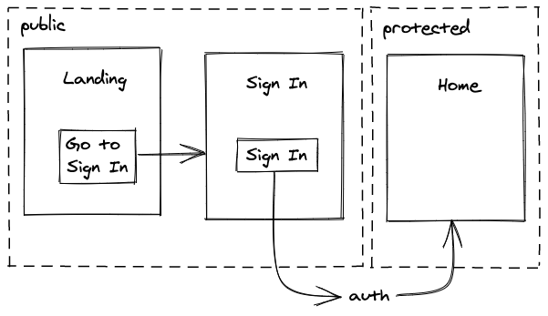
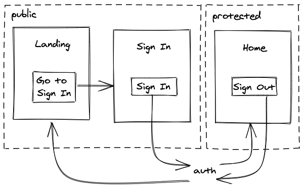
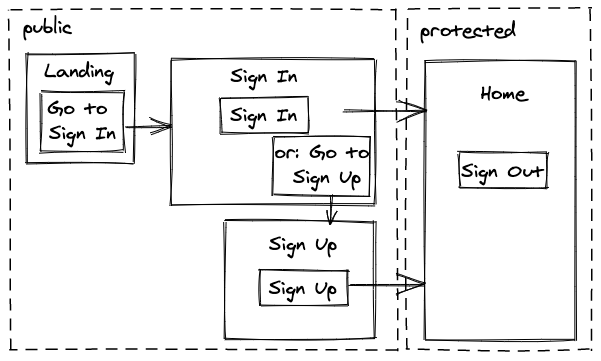
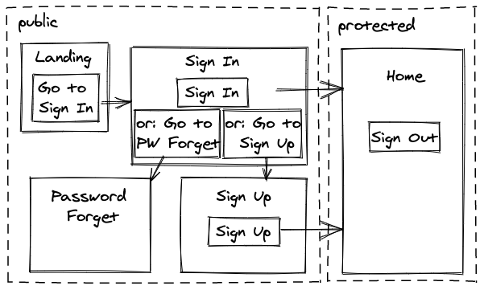
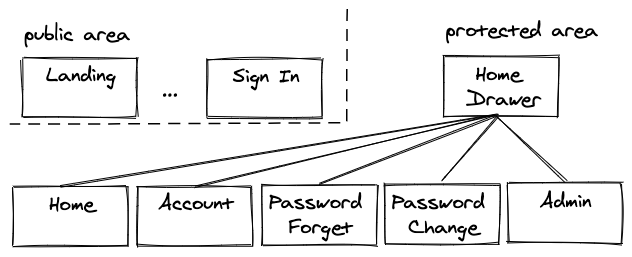

<Sponsorship />

<LinkCollection label="This tutorial is part 2 of 2 in this series." links={[{ prefix: "Part 1:", label: "How to use Expo with React Native", url: "/react-native-expo" }]} />

Here you will learn about the fundamentals of [React Navigation](https://reactnavigation.org/) and how to use it to navigate through a full blown React Native app. We will not be using [React Native Navigation](https://github.com/wix/react-native-navigation) here, because React Navigation is the officially baked library by React Native itself.

In order to install React Navigation, your best bet would be following the [installation instructions](https://reactnavigation.org/docs/getting-started) from the official documentation, because the dependencies change from time to time. However, I want to try to keep these in sync here, so you may want to follow my instructions as well.

```text
expo install @react-navigation/native
expo install react-native-gesture-handler
expo install react-native-reanimated
expo install react-native-screens
expo install react-native-safe-area-context
expo install @react-native-community/masked-view
```

As you can see, the project uses [Expo](https://expo.io), but I guess you can use vanilla React Native with `npm install` commands as well. Make sure to check again the official documentation of React Navigation here. After all, we will explore React Navigation's features in the next sections.

### Exercises:

* Read more about [getting started with React Navigation](https://reactnavigation.org/docs/getting-started).

# Stack Navigation with React Navigation

In this section, we will explore one navigation technique provided by React Navigation called **Stack Navigation**. We will start out with a basic App component in our *src/App.js* file without much style. If you want to make your app pretty, please go for it.

```javascript
import React from 'react';
import { StyleSheet, Text, View } from 'react-native';

const styles = StyleSheet.create({
  container: {
    flex: 1,
    alignItems: 'center',
    justifyContent: 'center',
  },
});

const App = () => {
  return (
    <View style={styles.container}>
      <Text>Hello React Native!</Text>
    </View>
  );
};

export default App;
```

From here, we want to implement two screens (also called pages) which allow us to navigate from one to another eventually. That's where React Navigation's most basic navigation technique Stack Navigation comes into play. We start by creating both screen components in their dedicated folders. First, *src/screens/Landing/index.js*:

```javascript
import React from 'react';
import { View, Text, StyleSheet } from 'react-native';

const styles = StyleSheet.create({
  container: {
    flex: 1,
    alignItems: 'center',
    justifyContent: 'center',
  },
});

const LandingScreen = () => {
  return (
    <View style={styles.container}>
      <Text>Public Landing Screen</Text>
    </View>
  );
};

export default LandingScreen;
```

And second, *src/screens/Home/index.js*:

```javascript
import React from 'react';
import { View, Text, StyleSheet } from 'react-native';

const styles = StyleSheet.create({
  container: {
    flex: 1,
    alignItems: 'center',
    justifyContent: 'center',
  },
});

const HomeScreen = () => {
  return (
    <View style={styles.container}>
      <Text>Protected Home Screen</Text>
    </View>
  );
};

export default HomeScreen;
```

Notice how both texts read "Public" and "Protected". This doesn't make much sense yet, but we will implement later a mechanism which allows only authenticated users to access the Home screen, while the Landing screen will be public to everyone. For now, both screens will be public though.


With both components implemented, which represent our two screens, we want to make use of them in the App component. Before we can utilize them there, we need to install the dependencies for the Stack Navigation on our command line:

```text
expo install @react-navigation/stack
```

Afterward, will will create the Stack Navigation in our *src/App.js* component by using both screen components:

```javascript{2-3,5-6,8,12-17}
import React from 'react';
import { NavigationContainer } from '@react-navigation/native';
import { createStackNavigator } from '@react-navigation/stack';

import LandingScreen from './screens/Landing';
import HomeScreen from './screens/Home';

const RootStack = createStackNavigator();

const App = () => {
  return (
    <NavigationContainer>
      <RootStack.Navigator>
        <RootStack.Screen name="Landing" component={LandingScreen} />
        <RootStack.Screen name="Home" component={HomeScreen} />
      </RootStack.Navigator>
    </NavigationContainer>
  );
};

export default App;
```

All navigations techniques (e.g. Stack Navigation) in React Navigation need to have the NavigationContainer component as wrapping component. I called this stack `RootStack`, because it's the first level in our **navigation hierarchy**. We will see later **how to nest other navigations** into this. Each RootStack's Screen component takes a `name` and a `component` as [React prop](/react-pass-props-to-component), in our case these are the Landing and Home screens and their respective names.

Once you restart your app, you should see the rendered Landing screen. The first screen (here `LandingScreen`) in the Stack Navigation gets rendered. If you swap both screens order, you should see the Home screen rendered first. You could also set a `initialRouteName="Home"` prop in the RootStack's Navigator component to force one of the screens -- in this case the Home screen -- to be the initially displayed screen. Anyway, next we will learn how to navigate from one page to another.

### Exercises:

* Read more about [Stack Navigation with React Navigation](https://reactnavigation.org/docs/hello-react-navigation).
* Read more about [customizing the Stack Navigation's header bar](https://reactnavigation.org/docs/headers).
* If you are confused by the folder structure, I follow these [React project structure guidelines](/react-folder-structure). If you don't like them, you can organize the code as you wish too.

# Navigating with React Navigation

We have two pages in our React Native app, but no way to navigate from one page to another page. This is the next feature you are going to learn about here. In the next step, we will implement a button which enables us the navigate from the Landing screen to the Home screen.



Because both screen components are child components of the Stack Navigation, we got access to the `navigation` prop for navigating from one page to another. By using a Button component, we can execute this navigation when pressing it:

```javascript{2,6,10-13}
import React from 'react';
import { View, Text, Button, StyleSheet } from 'react-native';

...

const LandingScreen = ({ navigation }) => {
  return (
    <View style={styles.container}>
      <Text>Public Landing Screen</Text>
      <Button
        title="Go to Home"
        onPress={() => navigation.navigate('Home')}
      />
    </View>
  );
};

export default LandingScreen;
```

Check your app again. You should be able to go from initially rendered Landing screen to Home screen. A bonus of the Stack Navigation is the back button on the Home screen, which allows you to navigate back from Home to Landing screen, without further implementations on the Home screen. Let's introduce another screen for our React Native app.


Instead of navigating from Landing to Home screen, we will navigate to a new Sign In screen:

```javascript{11-12}
import React from 'react';
import { View, Text, Button, StyleSheet } from 'react-native';

...

const LandingScreen = ({ navigation }) => {
  return (
    <View style={styles.container}>
      <Text>Public Landing Screen</Text>
      <Button
        title="Go to Sign In"
        onPress={() => navigation.navigate('Sign In')}
      />
    </View>
  );
};

export default LandingScreen;
```

The component for the Sign In screen will be placed in a new *src/screens/SignIn/index.js* file:

```javascript
import React from 'react';
import { View, Text, StyleSheet } from 'react-native';

const styles = StyleSheet.create({
  container: {
    flex: 1,
    alignItems: 'center',
    justifyContent: 'center',
  },
});

const SignInScreen = () => {
  return (
    <View style={styles.container}>
      <Text>Public Sign In Screen</Text>
    </View>
  );
};

export default SignInScreen;
```

Before the new page can work as expected, you have to use it as a new screen in the Stack Navigation which is located in our App component:

```javascript{6,16}
import React from 'react';
import { NavigationContainer } from '@react-navigation/native';
import { createStackNavigator } from '@react-navigation/stack';

import LandingScreen from './screens/Landing';
import SignInScreen from './screens/SignIn';
import HomeScreen from './screens/Home';

const RootStack = createStackNavigator();

const App = () => {
  return (
    <NavigationContainer>
      <RootStack.Navigator>
        <RootStack.Screen name="Landing" component={LandingScreen} />
        <RootStack.Screen name="Sign In" component={SignInScreen} />
        <RootStack.Screen name="Home" component={HomeScreen} />
      </RootStack.Navigator>
    </NavigationContainer>
  );
};

export default App;
```

Now we have three pages, whereas two pages should be public and another page (Home screen) should be protected. Protected means that this page should only be accessible by an authenticated user. Hence there is no direct navigation from Sign In screen to Home screen. We will learn in the next section how to close this gap.

### Exercises:

* Read more about [navigating with React Navigation](https://reactnavigation.org/docs/navigating).
* Read more about [passing parameters to routes](https://reactnavigation.org/docs/params).

# Authentication with React Navigation

We have two areas in our React native app now: public and protected. While it's possible to navigate within the public area -- back and forth between Landing screen and Sign In screen -- it's not possible yet to navigate to the protected area (here Home screen).


First, we will implement a pseudo sign in (also called log in) mechanism to mimic an authenticated user. Therefore, the Sign In screen implements a button for executing the actual sign in:

```javascript{2,6,10}
import React from 'react';
import { View, Text, Button, StyleSheet } from 'react-native';

...

const SignInScreen = ({ onSignIn }) => {
  return (
    <View style={styles.container}>
      <Text>Public Sign In Screen</Text>
      <Button title="Sign In" onPress={onSignIn} />
    </View>
  );
};

export default SignInScreen;
```

The implementation detail is not in the SignIn screen component, but is passed as [callback handler](/react-event-handler) (here `onSignIn`) from the App component. The App component implements this handler -- which simply toggles a boolean flag from `false` to `true` with [React's useState Hook](/react-usestate-hook):

```javascript{4,6-10}
...

const App = () => {
  const [isAuthenticated, setIsAuthenticated] = React.useState(false);

  const handleSignIn = () => {
    // TODO implement real sign in mechanism

    setIsAuthenticated(true);
  };

  return (
    <NavigationContainer>
      <RootStack.Navigator>
        <RootStack.Screen name="Landing" component={LandingScreen} />
        <RootStack.Screen name="Sign In" component={SignInScreen} />
        <RootStack.Screen name="Home" component={HomeScreen} />
      </RootStack.Navigator>
    </NavigationContainer>
  );
};

...
```

In order to pass this new handler to the SignIn screen, we need to adjust how the SignIn screen component is passed to the Stack Navigation. We are using [React's render prop pattern](/react-render-props) in order to pass more information to our SignIn screen component:

```javascript{16-20}
...

const App = () => {
  const [isAuthenticated, setIsAuthenticated] = React.useState(false);

  const handleSignIn = () => {
    // TODO implement real sign in mechanism

    setIsAuthenticated(true);
  };

  return (
    <NavigationContainer>
      <RootStack.Navigator>
        <RootStack.Screen name="Landing" component={LandingScreen} />
        <RootStack.Screen name="Sign In">
          {(props) => (
            <SignInScreen {...props} onSignIn={handleSignIn} />
          )}
        </RootStack.Screen>
        <RootStack.Screen name="Home" component={HomeScreen} />
      </RootStack.Navigator>
    </NavigationContainer>
  );
};

...
```

Now we have our lever to pseudo authenticate a user in our React Native app. If a user presses the button on the Sign In screen, the user's sign in state is toggled to `true`.



What's missing is giving the user access to the protected area. Therefore, we will implement a so called switch navigation with React Navigation by just using a [conditional rendering in React](/conditional-rendering-react):

```javascript{15,17,29}
...

const App = () => {
  const [isAuthenticated, setIsAuthenticated] = React.useState(false);

  const handleSignIn = () => {
    // TODO implement real sign in mechanism

    setIsAuthenticated(true);
  };

  return (
    <NavigationContainer>
      <RootStack.Navigator>
        {isAuthenticated ? (
          <RootStack.Screen name="Home" component={HomeScreen} />
        ) : (
          <>
            <RootStack.Screen
              name="Landing"
              component={LandingScreen}
            />
            <RootStack.Screen name="Sign In">
              {(props) => (
                <SignInScreen {...props} onSignIn={handleSignIn} />
              )}
            </RootStack.Screen>
          </>
        )}
      </RootStack.Navigator>
    </NavigationContainer>
  );
};

...
```

After pressing the "Sign In" button, the `isAuthenticated` boolean toggles to `true` which swaps the rendered screens with a conditional rendering. Since the Home screen is the only rendered screen in the protected area (due to `isAuthenticated`), the user sees this screen after the login. What's missing is the complementary feature for the sign out (also called log out).



Similar to the Sign In screen, we could implement a "Sign Out" button directly on the Home screen. However, instead of placing the button in the middle of the screen, we will utilize the header of the screen -- which is given by the Stack Navigation -- to place a "Sign Out" button there. Therefore, in your *src/App.js* file, implement the header button the following way:

```javascript{2,14-18,27-31}
import React from 'react';
import { Button } from 'react-native';
...

const App = () => {
  const [isAuthenticated, setIsAuthenticated] = React.useState(false);

  const handleSignIn = () => {
    // TODO implement real sign in mechanism

    setIsAuthenticated(true);
  };

  const handleSignOut = () => {
    // TODO implement real sign out mechanism

    setIsAuthenticated(false);
  };

  return (
    <NavigationContainer>
      <RootStack.Navigator>
        {isAuthenticated ? (
          <RootStack.Screen
            name="Home"
            component={HomeScreen}
            options={{
              headerRight: () => (
                <Button onPress={handleSignOut} title="Sign Out" />
              ),
            }}
          />
        ) : (
          <>
            <RootStack.Screen
              name="Landing"
              component={LandingScreen}
            />
            <RootStack.Screen name="Sign In">
              {(props) => (
                <SignInScreen {...props} onSignIn={handleSignIn} />
              )}
            </RootStack.Screen>
          </>
        )}
      </RootStack.Navigator>
    </NavigationContainer>
  );
};

...
```

Et voilà, a "Sign Out" button should show up on the Home screen's upper right corner. Once a user presses the button, the user signs out and moves back to the public area again. What may be odd is the animation from Home screen to Sign In screen when a user logs out. The animation looks like a forward animation (push), but what we may want there is a backward animation (pop):

```javascript{14-16}
...

const App = () => {
  ...

  return (
    <NavigationContainer>
      <RootStack.Navigator>
        {isAuthenticated ? ( ... ) : (
          <>
            <RootStack.Screen
              name="Landing"
              component={LandingScreen}
              options={{
                animationTypeForReplace: 'pop',
              }}
            />
            <RootStack.Screen name="Sign In">
              {(props) => (
                <SignInScreen {...props} onSignIn={handleSignIn} />
              )}
            </RootStack.Screen>
          </>
        )}
      </RootStack.Navigator>
    </NavigationContainer>
  );
};

...
```

Every time a user gets on the Landing screen, the screen appears with a pop animation instead of a push navigation. This feels more natural, because a logout should feel like a step back.

The sign in and sign out flow is complete by just using a conditional rendering with a boolean flag. If you would want to implement a real authentication mechanism here, you would have to log in an actual user with the sign in handler and log out the user with the sign out handler. What's missing for a minimal viable authentication flow would be the Sign Up screen.



We can implement this with another screen component in a new *SignUp/index.js* file in the *src/screens/* folder:

```javascript
import React from 'react';
import { View, Text, Button, StyleSheet } from 'react-native';

const styles = StyleSheet.create({
  container: {
    flex: 1,
    alignItems: 'center',
    justifyContent: 'center',
  },
});

const SignUpScreen = ({ onSignUp }) => {
  return (
    <View style={styles.container}>
      <Text>Public Sign Up Screen</Text>
      <Button title="Sign Up" onPress={onSignUp} />
    </View>
  );
};

export default SignUpScreen;
```

In the App component, in the *src/App.js* file, you import this new screen, hook it into the other public Stack Navigation, and pass in a handler for the sign up -- which only toggles the boolean and misses an actual implementation for the sign up (also called registration):

```javascript{5,17-21,40-44}
...

import LandingScreen from './screens/Landing';
import SignInScreen from './screens/SignIn';
import SignUpScreen from './screens/SignUp';
import HomeScreen from './screens/Home';

...

const App = () => {
  const [isAuthenticated, setIsAuthenticated] = React.useState(false);

  const handleSignIn = () => { ... };

  const handleSignOut = () => { ... };

  const handleSignUp = () => {
    // TODO implement real sign up mechanism

    setIsAuthenticated(true);
  };

  return (
    <NavigationContainer>
      <RootStack.Navigator>
        {isAuthenticated ? ( ... ) : (
          <>
            <RootStack.Screen
              name="Landing"
              component={LandingScreen}
              options={{
                animationTypeForReplace: 'pop',
              }}
            />
            <RootStack.Screen name="Sign In">
              {(props) => (
                <SignInScreen {...props} onSignIn={handleSignIn} />
              )}
            </RootStack.Screen>
            <RootStack.Screen name="Sign Up">
              {(props) => (
                <SignUpScreen {...props} onSignUp={handleSignUp} />
              )}
            </RootStack.Screen>
          </>
        )}
      </RootStack.Navigator>
    </NavigationContainer>
  );
};

...
```

Without any other additions, we would never be able to navigate to the new Sign Up screen. Therefore, implement a new button in the Sign In screen component, which gives users the option to sign up if they have no account yet:

```javascript{3,9,11-14}
...

const SignInScreen = ({ onSignIn, navigation }) => {
  return (
    <View style={styles.container}>
      <Text>Public Sign In Screen</Text>
      <Button title="Sign In" onPress={onSignIn} />

      <Text>OR</Text>

      <Button
        title="Go to Sign Up"
        onPress={() => navigation.navigate('Sign Up')}
      />
    </View>
  );
};

export default SignInScreen;
```

The authentication flow is complete. However, there are other additions to a well-rounded authentication. For example, a password forget feature:



We can implement this new screen in another new file called *PasswordForget/index.js* in the *src/screens/* folder:

```javascript
import React from 'react';
import { View, Text, StyleSheet } from 'react-native';

const styles = StyleSheet.create({
  container: {
    flex: 1,
    alignItems: 'center',
    justifyContent: 'center',
  },
});

const PasswordForgetScreen = () => {
  return (
    <View style={styles.container}>
      <Text>Password Forget Screen</Text>
    </View>
  );
};

export default PasswordForgetScreen;
```

Next, implement the navigation in the Sign In screen, because this is the only screen where users may notice that they forgot their password:

```javascript{15-18}
...

const SignInScreen = ({ onSignIn, navigation }) => {
  return (
    <View style={styles.container}>
      <Text>Public Sign In Screen</Text>
      <Button title="Sign In" onPress={onSignIn} />

      <Text>OR</Text>

      <Button
        title="Go to Sign Up"
        onPress={() => navigation.navigate('Sign Up')}
      />
      <Button
        title="Go to Password Forget"
        onPress={() => navigation.navigate('Password Forget')}
      />
    </View>
  );
};

export default SignInScreen;
```

And finally hook this new screen into our Stack Navigation in the App component, as we did before with the other screens:

```javascript{6,25-28}
...

import LandingScreen from './screens/Landing';
import SignInScreen from './screens/SignIn';
import SignUpScreen from './screens/SignUp';
import PasswordForgetScreen from './screens/PasswordForget';
import HomeScreen from './screens/Home';

...

const App = () => {
  ...

  return (
    <NavigationContainer>
      <RootStack.Navigator>
        {isAuthenticated ? ( ... ) : (
          <>
            ...
            <RootStack.Screen name="Sign Up">
              {(props) => (
                <SignUpScreen {...props} onSignUp={handleSignUp} />
              )}
            </RootStack.Screen>
            <RootStack.Screen
              name="Password Forget"
              component={PasswordForgetScreen}
            />
          </>
        )}
      </RootStack.Navigator>
    </NavigationContainer>
  );
};

...
```

The implementation logic for the password forget feature goes into the PasswordForget screen component. If you want to handle this logic on a more central location like the App component, you would have to pass down a callback handler like you did for the sign in and sign up.

After all, we should have everything essential set up for the authentication flow within the framework of React Navigation. The actual implementation logic for the authentication is up to you. For example, if you don't want to implement a backend application yourself, Firebase may be a great solution here. If you are able to implement a backend for the authentication, a Node.js application may be a good choice.

### Exercises:

* Read more about [Authentication Flows with React Navigation](https://reactnavigation.org/docs/auth-flow).
* Read more about [header buttons for the Stack Navigation](https://reactnavigation.org/docs/header-buttons).

# Drawer Navigation with React Navigation

We have four screens in the public area and one screen in the protected area. While the four screens in the public area may be sufficient for most apps, the protected area is often more sophisticated. For example, the protected area could have screens for the different features, account settings or the user's profile.

This is a good point in time to use a **Drawer Navigation** -- a new navigation technique from React Navigation -- as **nested navigation** within the previously implemented Stack Navigation.


First, you have to install the new Drawer Navigation technique on the command line:

```text
expo install @react-navigation/drawer
```

Second, use the new library to create a `Drawer` (similar to the `RootStack`) which encapsulates two screens: Home screen and Password Forget screen. Let me explain later why we are using the Password Forget screen here, for now, just follow the implementation:

```javascript{4,8-20}
...
import { NavigationContainer } from '@react-navigation/native';
import { createStackNavigator } from '@react-navigation/stack';
import { createDrawerNavigator } from '@react-navigation/drawer';

...

const Drawer = createDrawerNavigator();

const HomeDrawer = () => {
  return (
    <Drawer.Navigator>
      <Drawer.Screen name="Home" component={HomeScreen} />
      <Drawer.Screen
        name="Password Forget"
        component={PasswordForgetScreen}
      />
    </Drawer.Navigator>
  );
};

const RootStack = createStackNavigator();

...
```

Finally, instead of hooking the HomeScreen directly into the Stack Navigation, use the new HomeDrawer component -- which uses the HomeScreen -- in the Stack Navigation:

```javascript{10}
const App = () => {
  ...

  return (
    <NavigationContainer>
      <RootStack.Navigator>
        {isAuthenticated ? (
          <RootStack.Screen
            name="Home"
            component={HomeDrawer}
            options={{
              headerRight: () => (
                <Button onPress={handleSignOut} title="Sign Out" />
              ),
            }}
          />
        ) : ( ... )}
      </RootStack.Navigator>
    </NavigationContainer>
  );
};

...
```

If you are on the Home screen, you can open the drawer with a swipe gesture from the left border to the center of your phone. Both screens, the Home screen and the Password Forget screen, should be available in the drawer. Notice how the Password Forget screen is used at two places in the navigation hierarchy now. It's used in the public area, if a user forgot a password when signing in, but also in the protected area if a user wants to reset the password anyway.


Notice as well, how the Home screen is the initial page when rendering this nested navigation. This again depends on the order of the screen components in the HomeDrawer component. If the Password Forget screen would be the first screen in the implementation order, it would be rendered first too. As alternative, you could use the `initialRouteName` -- as mentioned earlier for the Stack Navigation -- as well.

You may notice that the header doesn't change if you navigate from Home to Forget Password screen. It just stays on Home, because the header comes from the Stack Navigation above which uses the initial screen for the rendered label in the header. If you want to track the change for this nested navigation within the Stack Navigation, you have to utilize this little helper function for the options. Be careful here, because you have to change the options object to a function which returns an options object in order to get access to the `route` parameter:

```javascript{4,19}
...
import {
  NavigationContainer,
  getFocusedRouteNameFromRoute,
} from '@react-navigation/native';
...

const App = () => {
  ...

  return (
    <NavigationContainer>
      <RootStack.Navigator>
        {isAuthenticated ? (
          <RootStack.Screen
            name="Home"
            component={HomeDrawer}
            options={({ route }) => ({
              headerTitle: getFocusedRouteNameFromRoute(route),
              headerRight: () => (
                <Button onPress={handleSignOut} title="Sign Out" />
              ),
            })}
          />
        ) : ( ... )}
      </RootStack.Navigator>
    </NavigationContainer>
  );
};

...
```

Not every user may be aware of the hidden drawer though. You can implement a button -- which toggles the drawer open or close -- in the parent Stack Navigation for all the nested screens in the Drawer component. This way, a user has a great user experience to toggle the drawer:

```javascript{4,19,21-28}
...
import {
  NavigationContainer,
  DrawerActions,
  getFocusedRouteNameFromRoute,
} from '@react-navigation/native';
...

const App = () => {
  ...

  return (
    <NavigationContainer>
      <RootStack.Navigator>
        {isAuthenticated ? (
          <RootStack.Screen
            name="Home"
            component={HomeDrawer}
            options={({ route, navigation }) => ({
              headerTitle: getFocusedRouteNameFromRoute(route),
              headerLeft: () => (
                <Button
                  onPress={() =>
                    navigation.dispatch(DrawerActions.toggleDrawer())
                  }
                  title="Menu"
                />
              ),
              headerRight: () => (
                <Button onPress={handleSignOut} title="Sign Out" />
              ),
            })}
          />
        ) : ( ... )}
      </RootStack.Navigator>
    </NavigationContainer>
  );
};

...
```

If you would use the Drawer Navigation as standalone navigation, you could perform `navigation.toggleDrawer()`. However, since we are using the Drawer Navigation nested in the Stack Navigation, and the Stack Navigation's `navigation` object doesn't know about the Drawer Navigation, we have to trigger an action from the outside with a `dispatch` function.



Finally, you have enough space to create more pages horizontally in your protected area. For example, what about an Account screen, a Password Change screen, and an Admin screen. Create all the screens in their dedicated folders. For example, the Account screen in the *src/screens/Account/index.js* file could be implemented the following way:

```javascript
import React from 'react';
import { View, Text, StyleSheet } from 'react-native';

const styles = StyleSheet.create({
  container: {
    flex: 1,
    alignItems: 'center',
    justifyContent: 'center',
  },
});

const Account = () => {
  return (
    <View style={styles.container}>
      <Text>Protected Account Screen</Text>
    </View>
  );
};

export default Account;
```

Create the Password Change and Admin screens with this blueprint yourself. Afterward, put all new three screens in the Drawer Navigation in the App component:

```javascript{7,9-10,18,23-27}
...

import LandingScreen from './screens/Landing';
import SignInScreen from './screens/SignIn';
import SignUpScreen from './screens/SignUp';
import PasswordForgetScreen from './screens/PasswordForget';
import PasswordChangeScreen from './screens/PasswordChange';
import HomeScreen from './screens/Home';
import AccountScreen from './screens/Account';
import AdminScreen from './screens/Admin';

const Drawer = createDrawerNavigator();

const HomeDrawer = () => {
  return (
    <Drawer.Navigator>
      <Drawer.Screen name="Home" component={HomeScreen} />
      <Drawer.Screen name="Account" component={AccountScreen} />
      <Drawer.Screen
        name="Password Forget"
        component={PasswordForgetScreen}
      />
      <Drawer.Screen
        name="Password Change"
        component={PasswordChangeScreen}
      />
      <Drawer.Screen name="Admin" component={AdminScreen} />
    </Drawer.Navigator>
  );
};

...
```

The Drawer Navigation offers you lots of space pages. All of these pages are only available in the protected area when a user is authenticated. In contrast, the Drawer (and the "Menu" button) are not available in the public area. Another crucial point may be the Admin screen, which is accessible to every user, but which may be later accessible only to users with a dedicated admin role/permission.


In this section we learned several concepts for React Navigation. First, you have seen how a screen can be used at multiple places (here Password Forget screen). In our case, this screen is used in the public and protected area due to the conditional rendering based on the authentication state. Second, you have used a Drawer Navigation which helps tremendously to align multiple pages. And third, you have used the Drawer Navigation as nested navigation within the Stack Navigation. Hence you had to dispatch an action from the Stack Navigation's header button in order to toggle the drawer. The Drawer Navigation can be used standalone as well.

### Exercises:

* Read more about [Drawer Navigation with React Navigation](https://reactnavigation.org/docs/drawer-based-navigation).
* Read more about [nesting navigators](https://reactnavigation.org/docs/nesting-navigators).

# Tab Navigation with React Navigation

You have learned about Stack Navigation and Drawer Navigation. Both can be used standalone or nested into each other. The same applies for another technique called Tab Navigation.


The Tab Navigation is used to highlight the main features of an app at the bottom of the phone screen. Therefore, we will nest the Tab Navigation into the Drawer Navigation. I will explain later why this makes sense. First, let's explore this kind of navigation by installing it on the command line:

```text
expo install @react-navigation/bottom-tabs
```

And then, use this new library to create the Tab Navigation which only uses the Home screen for now:

```javascript{4,8,9-16}
...
import { createStackNavigator } from '@react-navigation/stack';
import { createDrawerNavigator } from '@react-navigation/drawer';
import { createBottomTabNavigator } from '@react-navigation/bottom-tabs';

...

const Tab = createBottomTabNavigator();

const HomeTabs = () => {
  return (
    <Tab.Navigator>
      <Tab.Screen name="Home" component={HomeScreen} />
    </Tab.Navigator>
  );
};

...
```

Finally, use it in the Drawer Navigation. Instead of using the HomeScreen there, use the new HomeTabs (which in return use the Home screen now):

```javascript{8}
...

const Drawer = createDrawerNavigator();

const HomeDrawer = () => {
  return (
    <Drawer.Navigator>
      <Drawer.Screen name="Home" component={HomeTabs} />
      <Drawer.Screen name="Account" component={AccountScreen} />
      ...
    </Drawer.Navigator>
  );
};

...
```

You should see your first tab -- the "Home" tab -- at the bottom now. Let's add another screen for the Tab Navigation, otherwise it would be useless. We will create a new Profile screen component in a new *src/screens/Profile/index.js* file:

```javascript
import React from 'react';
import { View, Text, StyleSheet } from 'react-native';

const styles = StyleSheet.create({
  container: {
    flex: 1,
    alignItems: 'center',
    justifyContent: 'center',
  },
});

const Profile = () => {
  return (
    <View style={styles.container}>
      <Text>Protected Profile Screen</Text>
    </View>
  );
};

export default Profile;
```

And use this new screen in the Tab Navigation in the *src/App.js* file:

```javascript{9,19}
...

import LandingScreen from './screens/Landing';
import SignInScreen from './screens/SignIn';
import SignUpScreen from './screens/SignUp';
import PasswordForgetScreen from './screens/PasswordForget';
import PasswordChangeScreen from './screens/PasswordChange';
import HomeScreen from './screens/Home';
import ProfileScreen from './screens/Profile';
import AccountScreen from './screens/Account';
import AdminScreen from './screens/Admin';

const Tab = createBottomTabNavigator();

const HomeTabs = () => {
  return (
    <Tab.Navigator>
      <Tab.Screen name="Home" component={HomeScreen} />
      <Tab.Screen name="Profile" component={ProfileScreen} />
    </Tab.Navigator>
  );
};

...
```

Since you have the Tab Navigation nested in the Drawer Navigation for the "Home" route, the tabs only show up for the Tab Navigation's screens (here Home and Profile screens). If you navigate to some other preferences for your user in the drawer, the "Home" and "Profile" tabs disappear:

* If a user uses the primary features of the app, all the features should be one click away in the bottom Tab Navigation.
* If a user uses secondary features of the app, all the remaining features can be found in the Drawer Navigation.
* If a user uses a secondary feature, don't distract with the primary features.

In conclusion, using the Tab Navigation makes your app's features shine and easily accessible at the bottom of your phone's screen. Same as the Stack Navigation and Drawer Navigation, the Tab Navigation can be used standalone or nest other navigations as well.

### Exercises:

* Read more about [Tab Navigation with React Navigation](https://reactnavigation.org/docs/tab-based-navigation).
* Read more about [the navigation lifecycle](https://reactnavigation.org/docs/navigation-lifecycle).

<Divider />

You have learned about Stack Navigation, an implementation of a switch navigation with a conditional rendering, Drawer Navigation and Tab Navigation with React Navigation. While learning about these kinds of navigation, you have implemented a whole auth flow by nesting these navigations into each other. There is no authentication logic yet, however, the whole navigation flow should be pretty popular among native apps, so it doesn't hurt to internalize what you have learned here.

