<Sponsorship />

Let's start with a story: When people outside of my professional bubble ask me about what I am doing, I say *"I build websites."*. If they are curious, I add that these websites are sometimes more complex. If they continue to ask, I try to elaborate with examples: Facebook, Spotify, Twitter. It's not that I work for these companies, but I hope it gives a good impression about "what kind of websites I build". However, most often it doesn't get beyond "I build websites" and I am fine with it.

A website doesn't equal a website these days. A website ranges from a marketing website for a product to a sophisticated social media platform. As someone new to web development, it's not easy to grasp the landscape: What starts out as a traditional website with HTML and CSS, which is returned from a web server, turns into a way more difficult full-stack application with sophisticated client-server communication and state management. If you are already into learning HTML, CSS, and JavaScript, without knowing about the fundamentals of websites and web applications in the first place, then this tutorial is for you.

In this walkthrough, I want to show you the evolution of web development from website to web application where we clarify terms like client/server, client application/server application, frontend/backend, website/web application, REST/GraphQL, web server/application server, server-side rendering vs client-side rendering, server-side routing vs client-side routing and full-stack applications.

# A traditional Website

If you are learning about web development, you will most likely start with a traditional website build with HTML and CSS. A website which isn't styled (CSS) and doesn't have any logic (JavaScript) comes with just HTML.


If you navigate to a specific [URL](https://en.wikipedia.org/wiki/URL) in your browser (e.g. Firefox) on your laptop or smartphone, a request is made to the web server which is in charge for this URL. If the web server is able to match the request to a website, it serves the HTML file for the website back to your browser.

For transferring a website to a browser, [HTTP](https://en.wikipedia.org/wiki/Hypertext_Transfer_Protocol) is used as the communication protocol for requests and responses between client and web server. This is why there is a "http" in front of every URL.

The communication between client and server is asynchronous, which means that your website isn't displayed immediately. It takes time to send a request from client to web server and vice versa a response from web server to client.


A HTTP request comes with four essential HTTP methods that I want to tackle here: GET, POST, PUT, DELETE. While a HTTP GET method is used to read a resource, the remaining methods are used to write resources -- where a resource can be anything from HTML to JSON. All four methods can be abstracted to the infamous [CRUD](https://en.wikipedia.org/wiki/Create,_read,_update_and_delete) operations: Create, Read, Update, Delete.

```text
Create  -> HTTP POST
Read    -> HTTP GET
Update  -> HTTP PUT
Delete  -> HTTP DELETE
```

In our example of a website, which is served from a web server to a client by visiting a URL in a browser, the browser executes a HTTP GET method to read a HTML file from the web server.

## What's the difference between Client vs Server?

A Client is an entity that **consumes** a Server. It either reads resources from a server or writes resources to a server. For a traditional website, the client is your browser. If you navigate to a specific URL in your browser, your browser communicates with a server to request resources (e.g. HTML) to display a website for you. Looking beyond traditional websites, a client doesn't need to be a browser (e.g. [cURL](https://en.wikipedia.org/wiki/CURL)).

A Server is an entity that **serves** a Client. In a traditional sense of a website, a server reacts on a client's requests; and either replies with resources (e.g. HTML, CSS, JavaScript) from HTTP GET requests or acknowledges manipulations from HTTP POST, PUT, DELETE requests. Popular web servers, which are a specific kind of server, are [NGINX](https://en.wikipedia.org/wiki/Nginx) or [Apache](https://en.wikipedia.org/wiki/Apache_HTTP_Server).

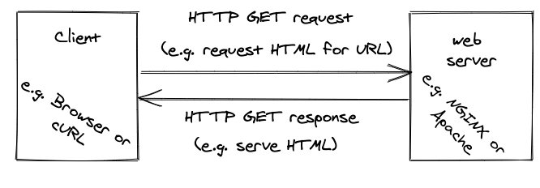

One can say that there is no client without a server and no server without a client. They work together, even though they don't need to be in the same location. For example, while your browser on your machine is at your local location (e.g. Berlin/Germany), the web server which serves a website sits at a remote location (e.g. Frankfurt/Germany). A server -- which is just another computer -- usually sits somewhere else than your local machine. For the sake of developing a server, you may have the server on your local machine too (see [localhost](https://en.wikipedia.org/wiki/Localhost)).


Since a client doesn't necessarily need to be a browser on your local machine, it could be somewhere remote as well. But more about this later.

## What's the difference between Web Server and Application Server?

A Web Server serves resources (e.g. HTML, CSS, JavaScript) which are designed to be communicated via HTTP. When a client requests resources from a web server, the web server fulfils the request by sending the resources back to the client. The resources are just files on this server. If HTML is sent to a client, the client (here browser) just executes the HTML to render it.

In contrast, an Application Server serves resources beyond HTML, CSS, JavaScript. For example, [JSON](https://en.wikipedia.org/wiki/JSON) can be sent if a client requests data in a data friendly format. In addition, an application server isn't bound to a protocol as well. Whereas a web server is mainly used with the HTTP protocol, an application server can use other protocols too. The most important fact is that an application server can have sophisticated [logic](https://en.wikipedia.org/wiki/Business_logic) on its server-side in a specific programming language (e.g. [JavaScript with Node.js](https://nodejs.org/en/), PHP, Java, Ruby, C#).

Both web server and application server can be classified as servers. So usually you will hear people talk about servers, when they mean one of these two. However, people will also say server for the physical computer, which runs somewhere remote, which employs the web server or application server.

There are two more terms which may come up: deploying and hosting. Let me keep it short on these terms: While deploying describes the act of taking a website live on a server, hosting describes the continuous act of serving the website from this server. That's why when developing a website on your computer, you have to open it up with the URL localhost, which just means that you are the local host of this website.

## What's happens when I change the path of an URL?

What happens if a user visits a website by URL and navigates at this domain (e.g. mywebsite.com) from path (e.g. /about) to path (/home)? For a traditional website, for every distinct URL a new request is made from a client to a web server.

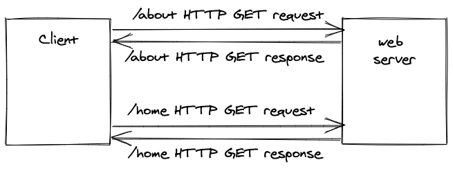

For every URL, a distinct HTTP GET method is sent to the dedicated web server to fulfil the request. When a user accesses a website on its `/about` path (also called page or route) in a browser, for example `http://www.mywebsite.com/about`, the web server sends all the information about this URL back to the browser. This act is called **server-side routing**, because the server decides which resource is sent to a client on each URL. You will learn about client-side routing later.

## What's happens when my website is more than HTML?

A modern website consists of HTML (structure), CSS (style), and JavaScript (logic). Without CSS a website wouldn't be shiny and without JavaScript a website wouldn't have dynamic interactions. After all, CSS and JavaScript is written down in files like HTML. Usually these files are linked in a HTML file:

```html
<link href="/media/examples/link-element-example.css" rel="stylesheet">

<p>Red text as defined in the external CSS file.</p>
```

If a browser asks a web server for the HTML of an URL, the web server sends back the HTML file which may include HTML `link` tags to other resources like CSS or JavaScript files. For every link, another request is made to the web server to retrieve the files.

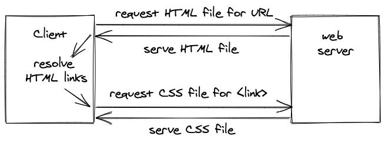

These are also called [waterfall requests](https://www.keycdn.com/blog/waterfall-analysis), because one request has to wait for another request to finish. In our example, the browser doesn't know that it needs to request the CSS file before the HTML file arrives with the HTML `link` tags. And in the next example the HTML file links to a JavaScript and CSS file, whereas the CSS file links to another JPG file.


However, at least if there are multiple HTML `link` tags in the initial HTML file, these resources will be requested and resolved in parallel, as seen in the previous example, but also illustrated in the next one.


Eventually the browser will have all resources (e.g. HTML, CSS, JavaScript, PNGs, JPGs, SVGs) for a specific URL and renders the desired result for you. It's ready for you to interact with it as a user.

# Websites in Web 2.0

Eventually just serving **static content** from a web server wasn't enough. In [Web 2.0](https://en.wikipedia.org/wiki/Web_2.0), it became possible for users not only to read content, but also to create content; which led to **dynamic content**. Remember the HTTP methods from earlier? So far, we have only seen HTTP GET methods in action for reading resources, but what about the other HTTP methods?

With the rise of [content management systems](https://en.wikipedia.org/wiki/Content_management_system) like Wordpress, a web server had to enable users to not only see resources, but also to manipulate them. For example, a user using a content management system must be able to log in, to create a blog post, to update a blog post, to delete a blog post, and to log out. At this time, the programming language [PHP](https://en.wikipedia.org/wiki/PHP) (which could be interpreted by a web server on the server-side) was the best fit for these kinds of dynamic websites.


Having the logic on the server-side, developers are enabled to process reading and writing requests from their users. If a user wants to create a blog post (write operation), the user has to write the blog post in a browser and click a "Save" button to send the content to the server-side logic running on the web server. This logic verifies the user is authorized, validates the blog content, and writes the content in a database.

Since we still have **server-side routing**, the web server is able to redirect the user to a new page after the blog post has been created successfully. For example, the redirect could be to the newly published blog post. If there is no redirect, a HTTP POST/PUT/DELETE request usually leads to a page refresh/reload anyway.


Since users are able to create dynamic content now, we need to have a database to store this data. The database can be on the same physical server (computer) like the web server (most likely in the early days of Web 2.0) or on another remote computer (most likely in the modern era of web development).


Once the blog post is inserted in the database, an unique identifier may be generated for this blog post which can be used to redirect the user to the newly published blog post's URL. All of this still happens asynchronously.


Now, after a blog post has been created, how does a server send a HTML file for a blog post if the data for it isn't static, but instead stored in a database? That's where the principal of **server-side rendering** (not to mistake with server-side routing) comes into play.

Both Web 1.0 with consumer oriented websites (static content) and Web 2.0 with producer oriented websites (dynamic content) return HTML from the server. A user navigates to an URL in the browser and requests the HTML for it. However, for the dynamic content in Web 2.0, the HTML which is sent to the client isn't a static HTML file with static content anymore, because it gets interpolated with dynamic content from the database now.

```html
<?php if ($expression == true): ?>
  This will show if the expression is true.
<?php else: ?>
  Otherwise this will show.
<?php endif; ?>
```

**Templating engines** for different programming languages (e.g. Pug for JavaScript on Node.js, Twig for PHP, JSP for Java, Django for Python) enable the interpolation of HTML and dynamic data before it's sent to the client. With the help of server-side rendering, user generated content can be served from a server to a client within HTML by creating the HTML on the fly when a client requests it.

Are we still dealing with a Website here? Technically yes, but websites which go beyond static content by serving dynamic content from a web server (or application server) with a database may be called web applications as well. The line between both types is blurry though.

# Single-Page Applications

The rise of [single-page applications (SPAs)](https://en.wikipedia.org/wiki/Single-page_application) made JavaScript popular. But I am getting ahead of myself. Prior to this era, website were mainly made with HTML plus CSS and only a sprinkle of JavaScript. The little JavaScript was used for animations or DOM manipulations (e.g. removing, adding, modifying of HTML elements), but not much beyond this. And [jQuery](https://en.wikipedia.org/wiki/JQuery) was one of the most popular libraries to perform such tasks.

But who would have thought that entire applications could be build with JavaScript? A few of the earlier libraries/frameworks to write single-page applications in JavaScript were Knockout.js, Ember.js, and Angular.js; while React.js and Vue.js were released later. Most of them are still very active to this day in modern web applications.

Prior to single-page applications, a browser would request the HTML file and all linked files from a web server for a website. If a user happens to navigate from page (e.g. /home) to page (e.g. /about) within the same domain (e.g. mywebsite.com), there would be *a new request to the web server for every navigation*.

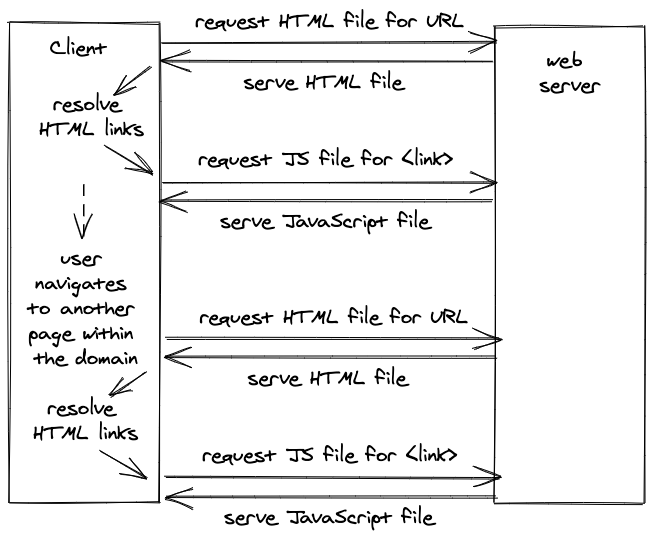

In contrast, a **single-page application** encapsulates the entire application in mostly JavaScript which has all the knowledge about how and what to render with HTML (and CSS) inside it. For the most basic usage of a single-page application, *the browser would request only once a HTML file with one linked JavaScript file* for a domain which hosts an SPA.


The requested HTML for a single-page application (here a React application) is just a middleman to request the JavaScript application (here *bundle.js*) which after it has been requested will be rendered in the HTML (here `id="app"`):

```javascript{8}
<!DOCTYPE html>
<html>
  <head>
    <title>Hello HTML File which executes a React Application</title>
  </head>
  <body>
    <div id="app"></div>
    <script src="./bundle.js"></script>
  </body>
</html>
```

From there, React takes over with this little JavaScript from a *./bundle.js*:

```javascript
import React from 'react';
import ReactDOM from 'react-dom';

const title = 'React with Webpack and Babel';

ReactDOM.render(
  <div>{title}</div>,
  document.getElementById('app')
);
```

In this little React application, only a variable called `title` is displayed in a HTML `div` element. However, everything between the HTML `div` element can be replaced with an entire HTML structure built with React and its templating syntax JSX. This is essentially a templating engine from earlier, but just executed on the client instead of the server and therefore this isn't server-side rendering anymore.

Because of this change from server to client execution of the rendering, we call it **client-side rendering** now. In other words: Instead of serving the pre-rendered HTML directly from the web server, we serve mainly JavaScript from the web server which executes on the client and only then renders the HTML.

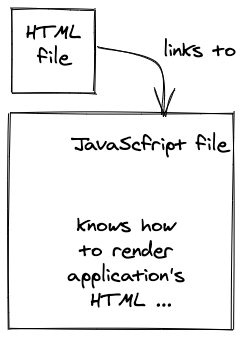

If the SPA is requested only once from a web server, how does it work when a user navigates from one page to another page within the same domain (e.g. mywebsite.com/about to mywebsite.com/home) without requesting another HTML? With the usage of a traditional SPA, we also moved from server-side routing to **client-side routing**. The initially requested JavaScript file for the basic SPA has all the pages of a website encapsulated. Navigating from one page (e.g. /about) to another page (e.g. /home) wouldn't perform any request to the web server. Instead, a client-side router (e.g. React Router for React) takes over to render the appropriate page from the initially requested JavaScript file.

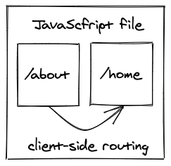

In a nutshell: A basic single-page application uses client-side rendering/routing over server-side rendering/routing while retrieving the entire application only once from a web server. It's a single page, because there is only one request made for the entire application, which is a single page consisting of an HTML file which links to one JavaScript file; which has all the pages encapsulated and executes on the client-side.

One could say that before single-page application we have worked with multi-page applications, because for every page (e.g. /about) a new request is made to the web server to retrieve all the necessary files for it. However, the term multi-page application isn't really a thing, because it was the default before single-page applications became popular.

*Note: Requesting the entire application as JavaScript file becomes a disadvantage once the application grows in size. For a more sophisticated single-page application, techniques like **code splitting** are used to serve only a fraction of the application that is needed for the current page (e.g. mywebsite.com/home). When navigating to the next page, another request is made to the web server to request the fraction for this page.*

### Exercises:

* Learn [how to use React](https://www.roadtoreact.com/) for single-page application development.
* Learn [how to set up a React with Webpack application](/minimal-react-webpack-babel-setup/) from scratch.

# Full-Stack Applications

We are entering the paradigm of full-stack applications now. A full-stack application includes client (e.g. SPA) and server application. If companies are looking for full-stack developers, they often want to have someone who is able to create client-server applications on both ends. Sometimes the client and server share the same programming language (e.g. JavaScript with React on the client, JavaScript with Node.js on the server), but they don't have to.

Anyway, why do we need full-stack applications? The need for full-stack applications was born due to the rise of single-page applications on the client-side.


So far, we went from traditional websites with HTML/CSS/JavaScript to modern web applications (e.g. React applications). Rendering static content is fine, but how do we render dynamic content, for example user specific content like a blog post, if only JavaScript (and a little HTML) is served from a web server to a client when dealing with SPAs?

The SPA application -- which is encapsulated in a JavaScript file -- doesn't have any user specific data. It's just the logic for the pages; what they look like and how they behave for user interactions. The actual data isn't embedded in there, because it still sits somewhere in a database and doesn't get interpolated on the server anymore. That's the tradeoff you have to make when moving from server-side rendering to client-side rendering.


Therefore, another request from client to server has to be made for requesting the missing data to fill in the blanks on the client. The client-side templating engine takes care of interpolation content (data) with structure (HTML).

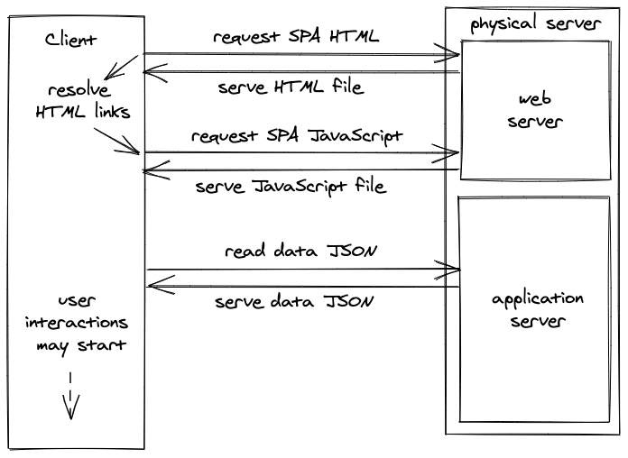

Once everything is rendered in the browser, a user starts to interact with the application -- for instance by creating a new blog post. JSON is a preferred format to send data from client to server and vice versa. The server deals with all the requests from the client by reading from or writing to the database; which can be on the same physical server, but doesn't need to be (e.g. just sitting on another physical server).

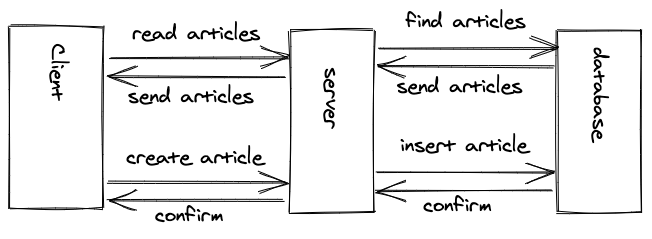

Client-side rendered applications come with the caveat of not having all the data at their disposal from the beginning. They have to request everything to fill in the blanks. In addition, they have to deal with problem of state management, because user interactions and data need to be stored and managed somewhere on the client. When performing client-side routing, requests for data can be minimised through state management. Ideally, navigating from one page to another and then back to the initial page should not trigger a second request for data for that initial page -- it should already be cached on the client.

Last, but not least, the interface between a client and a server is called an [API](https://en.wikipedia.org/wiki/Application_programming_interface). In this case, it's a specific kind of API between two remote entities, here a client and a server, however lots of things are called APIs in programming.

### Exercises:

* Read more about [different kinds of APIs](/what-is-an-api-javascript).

# Client-Server Communication

Traditional full-stack applications use [REST](https://en.wikipedia.org/wiki/Representational_state_transfer) as their API paradigm; which employs HTTP methods for CRUD operations. Previously we have already been using HTTP methods for CRUD operations -- without following clear constraints -- among files and user interactions like creating a blog post with server-side languages like PHP.

However, when using a REST API we are using these HTTP methods on **RESTful resources**. For example, a RESTful resource could be a blog post. A user can read blog posts with a HTTP GET from the application server or create a new blog post with a HTTP POST on the application server.

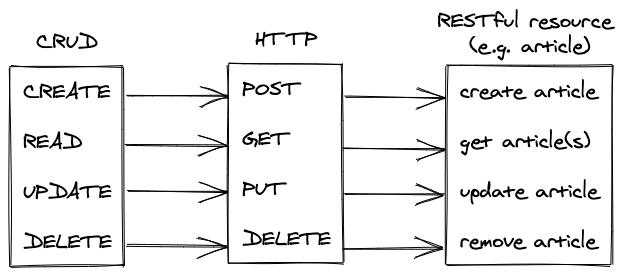

A REST API connects client and server applications without them needing to be implemented in the same programming language. They only need to offer a library for sending HTTP. REST is a communication paradigm which is free of a data format (but most often you will see JSON) and programming language.

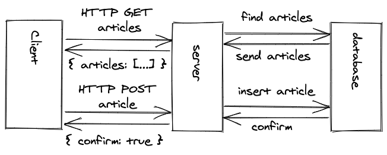

A modern alternative to REST is [GraphQL](/why-graphql-advantages-disadvantages-alternatives/) for APIs between clients and servers. GraphQL isn't bound to a data format either, and in contrast to REST not bound to HTTP, but most often you will see HTTP and JSON used here as well.

With the technology discussed up to this point, full-stack applications decouple client and server applications. Both communicate via a well-chosen API (e.g. REST or GraphQL). While the client application renders everything necessary for the web application in the browser, the server application handles requests from the client for read and write operations.

### Exercises:

* Learn [how to create a REST API with Node.js](/node-express-server-rest-api/).
* Read more about [why you would want to use GraphQL instead of REST](/why-graphql-advantages-disadvantages-alternatives).
* Learn [how to use GraphQL](https://www.roadtographql.com/) for full-stack JavaScript applications.

# Frontend and Backend

We haven't discussed the terms frontend and backend yet, because I didn't want to add too much information upfront. A frontend application may be everything a user sees in the browser (e.g. website, web application, SPA). Hence you will see frontend developers most often work with HTML/CSS or a client-side library like React.js. In contrast, a backend is often the logic behind the scenes: It's the logic which reads from and writes to a database, the logic that speaks to other applications, and often the logic that offers an API.

Both entities result in a client-server architecture (frontend and backend relationship) whereas the backend would be needed for (A) business logic that shouldn't be exposed as source code to the frontend application -- otherwise it would be accessible in the browser -- or for (B) establishing sensitive connections to third-party data sources (e.g. database(s)).


However, don't mistake client application always for frontend and server application always for backend here. These terms cannot be exchanged that easily. Whereas a frontend application is usually something seen in the browser, a backend usually performs business logic that shouldn't be exposed in a browser and often connects to a database as well.

But, in contrast, the terms client and server are a matter of perspective. A backend application (Backend 1) which consumes another backend application (Backend 2) becomes a client application (Backend 1) for the server application (Backend 2). However, the same backend application (Backend 1) is still the server for another client application which is the frontend application (Frontend).

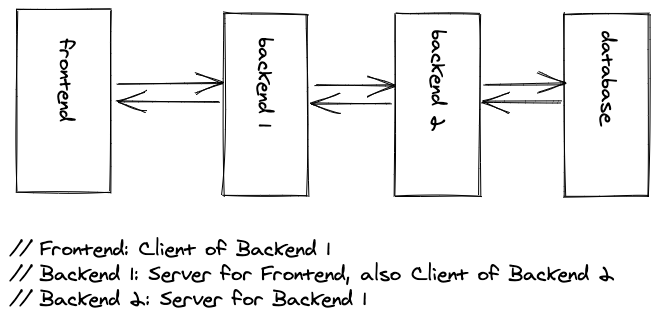

If you want to answer the client-server question if someone asks you what role an entity plays in a client-server architecture, always ask yourself who (server) is serving whom (client) and who (client) consumes whom's (backend) functionalities?

## Microservices (Optional)

For example, microservices is an architecture which splits up one big backend into smaller backends (also called monolith vs microservices). Each smaller backend may have one domain specific functionality, but they all serve one frontend after all. However, a backend can also consume another backend, whereas the former backend becomes a client and the latter backend the server.

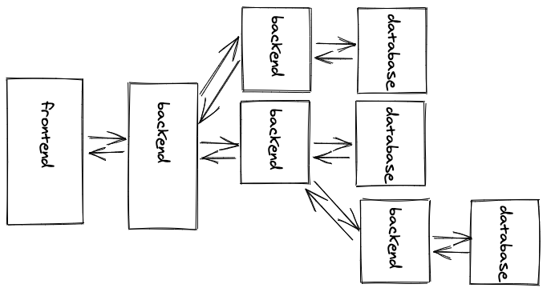

In a microservice architecture, each backend application can be created with a different programming language, while all backends are able to communicate with each other via APIs. It doesn't matter which API paradigm they choose, whether REST API or GraphQL API, as long as a client who speaks to their servers understands the API specification. It can also happen that a frontend doesn't speak to only one backend, but to multiple backends side-by-side.

### Exercises:

* Read [why I stopped using Microservices as a solo developer](/microservices-tradeoffs/).

## Backend-As-A-Service (Optional)

In a traditional sense, a single backend application, which is only there to serve one frontend application, often connects to a database. That's a typical full-stack application. However, most often the backend application doesn't do much except for reading from and writing to a database, permitting certain users to perform certain actions (authorization), or authenticating (e.g. log in, log out, register) the user in the first place. If this is the case, it's often not needed to implement a backend application yourself.

Firebase, one solution for a backend as a service, offers a database, authentication and authorization as a backend out of the box. A developer is only left with implementing the frontend application (e.g. React application) which needs to connect to this backend as a service.

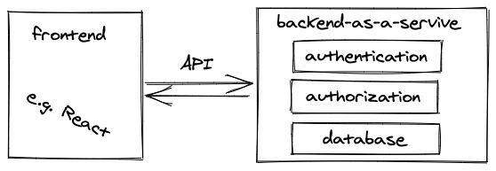

A backend as a service (BAAS) such as Firebase allows a developer to get up and running with their frontend application very quickly. Everything from authentication, authorization and database is done for you. In addition, most BAAS offer hosting as well, for example your React application can be hosted with Firebase too. So Firebase serves your React application to your client (browser) and enables your application to speak to it for all the other features (e.g. database).

### Exercises:

* Learn [how to use Firebase with React](https://www.roadtofirebase.com/).

# Beyond Full-Stack Applications

If all of this wasn't too confusing for you yet, try to keep up with me with the latest developments for full-stack applications. With all the development from traditional website to full-stack applications, you may have noticed the shifts from X to Y often make things more complicated ...

* Server-Side Rendering (X) to Client-Side Rendering (Y)
* Server-Side Routing (X) to Client-Side Routing (Y)

In the following, I want to present you two approaches, whose philosophies (SSR, SSG) aren't new but which are super powerful when used with modern libraries (e.g. React) and other frameworks (e.g. Next.js, Gatsby.js) which make these approaches possible. I am a React developer, that's why the suggestions for these technologies are biased, however, I am sure you may find similar technologies for your preferences as well.

## Server-Side Rendering 2.0 (SSR)

We have learned about server-side rendering for Web 2.0 before. At a later point in time, full-stack applications decoupled client and server and introduced client-side rendering with libraries like React. So what about taking one step back again and use React for server-side rendering?

When using the popular Next.js framework, which sits on top of React, you are still developing React applications. However, everything you implement in Next.js will be server-side rendered React. In Next.js, you implement each page (e.g. /about, /home) with React. When a user navigates from page to page, only a fraction of the server-side rendered React is sent to the browser. The great thing about it: You can already request the data to fill in the blanks on the server, interpolate the data with React, and send it to the client without any gaps.

This is different from client-side rendering, because there React only takes over on the client-side, and only starts to request the data to fill in the gaps once it has received the initial javascript. With SSR React, you have control on both ends.

### Exercises:

* Learn [how I use Next.js](https://twitter.com/rwieruch/status/1243209627707346944) for my course website.
* Learn [Next.js](https://nextjs.org/) for React.

## Static Site Generation (SSG)

Traditional websites use static files from a web server to be rendered on a browser. As we have learned, there is no involvement of an application server and no involvement of server-side rendering. The approach of a traditional website is pretty straightforward, because a web server just hosts your files and on every URL a user visits your browser makes a request to get the necessary files. So what if we could use React for static files?

React per se isn't made for static files. Instead, React is just JavaScript files which create the application on the fly on the client-side. However, Gatsby.js, a framework which sits on top of React, is used for static site generation for React applications. Gatsby takes a React application and compiles it to static files. Then all these files can be hosted on a web server. If a user visits a URL, the static files are served to the browser.

In contrast to server-side rendering React, the static files are not created on the fly when a user requests them but are only created once on build time. This can be a drawback for dynamic content, however, for marketing pages or blogs with content which doesn't change often, building your website only once in a while is okay.

### Exercises:

* Learn [how I use Gatsby.js](https://www.robinwieruch.de/react-gatsby-js) for my website.
* Learn [Gatsby.js](https://www.gatsbyjs.org/) for React.

<Divider />

If anything is missing in this marathon from website to web application, please let me know. I hope you enjoyed reading it! If you think it would be a good idea to add more content to this blog post and release it as 101 web development, let me know and sign up for my Newsletter to hear more about it :-)


